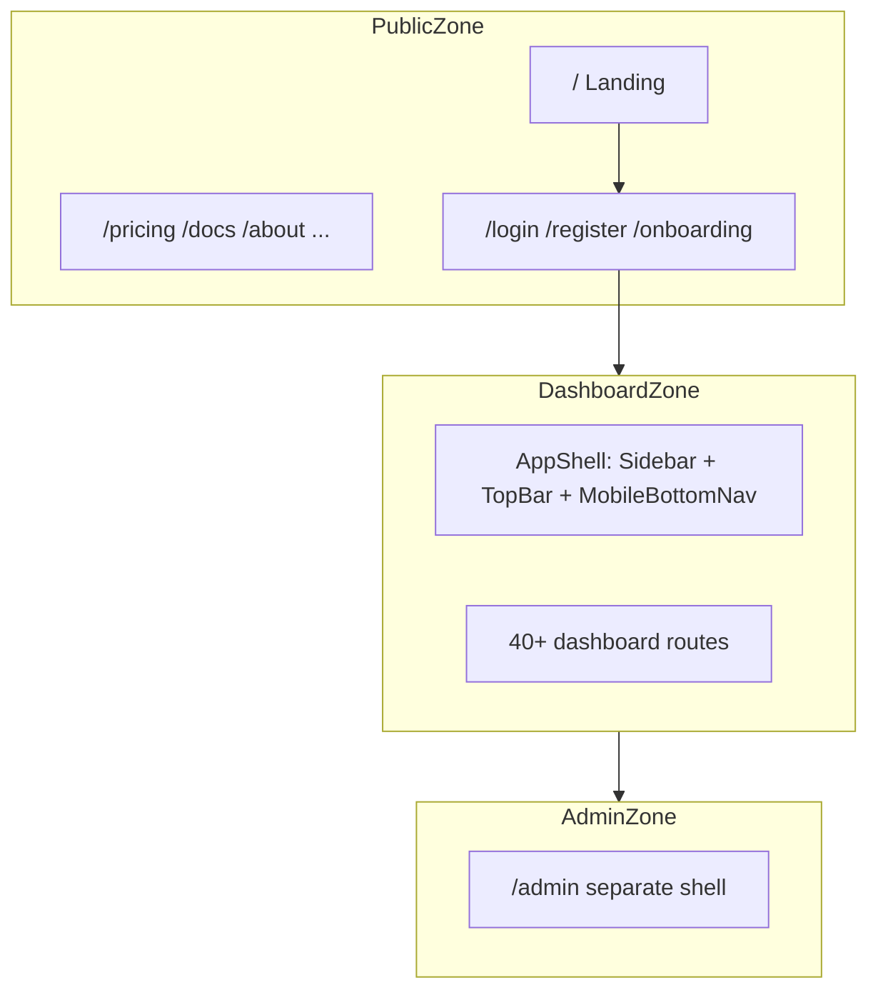

# Profytron Frontend UI/UX Audit

**Scope:** `apps/web` — Next.js app (~323 TSX/CSS files, 68 route pages) across public marketing, auth, dashboard, and admin.

**Method:** Static code review of layouts, shared primitives, page implementations, global CSS (`src/styles/globals.css`, `animations.css`), and Playwright test coverage. Supplemental live fetch of production (`www.profytron.com`). **No code changes.** Theme/color palette direction is explicitly **out of scope**; findings focus on polish, consistency, alignment, and professional UX defects (including surface inconsistency, not palette recommendations).

**Date:** June 22, 2026

**Limitation:** Pixel-level misalignment, scroll jank on real devices, and authenticated dashboard flows require a follow-up visual QA pass with a test account. This report flags code-level risks and patterns that typically cause sloppy UI.

---

## Application surface map



**Key shell files:**

| Zone | Files |
|------|-------|
| Dashboard | `src/components/layout/AppShell.tsx`, `Sidebar.tsx`, `TopBar.tsx`, `MobileBottomNav.tsx` |
| Public marketing | `src/components/layout/PublicPageLayout.tsx`, `PublicNavbar.tsx` |
| Landing | `src/components/home/LandingPageClient.tsx`, `src/components/layout/LandingNavbar.tsx` |
| Admin | `src/app/admin/layout.tsx` |

---

## Severity legend

| Level | Meaning |
|-------|---------|
| **P0** | Looks broken or blocks core UX (wrong state, dead interaction, misleading UI) |
| **P1** | Clearly unprofessional / inconsistent on common paths |
| **P2** | Polish, edge cases, or maintainability that affects perceived quality |

---

## 1. Executive summary — top 10 issues by user impact

| # | Severity | Issue | User impact |
|---|----------|-------|-------------|
| 1 | **P0** | Hardcoded notification badge `3` in sidebar | Users always see “3 unread” — misleading, erodes trust |
| 2 | **P0** | `Switch` controlled-state bug | Toggles show wrong state after async save/refetch |
| 3 | **P0** | Login submit shimmer never fires (`group` class missing) | Auth polish dead; login feels flatter than register |
| 4 | **P1** | Core trading routes missing from sidebar (`/strategies`, `/copy-trading`, `/bots`) | Users must discover key features via CTAs or command palette |
| 5 | **P1** | Mobile bottom nav covers only 5 destinations | Mobile users get materially reduced IA vs desktop |
| 6 | **P1** | Dual styling systems (shadcn + `.dash-*` CSS utilities) | Same conceptual UI looks different page-to-page |
| 7 | **P1** | Four modal/overlay patterns coexist | Inconsistent close affordances, z-index, backdrop |
| 8 | **P1** | `motion.tr` row animations on financial tables | Jank on filter/sort/refresh — unprofessional on data tables |
| 9 | **P1** | Validation UX split (inline vs toast-only) | Dashboard/settings errors easy to miss |
| 10 | **P1** | `prefers-reduced-motion` over-corrects globally | Kills useful focus/hover feedback for accessibility users |

**Recommended fix order:** P0 items first (badge, Switch, login shimmer), then navigation IA (sidebar + mobile nav), then consolidate styling/modal patterns before polish passes on tables and motion.

---

## 2. Findings by zone

### 2.1 Public / marketing

| ID | Sev | Finding | File(s) |
|----|-----|---------|---------|
| PUB-1 | P1 | Duplicate nav implementations: `LandingNavbar` vs `PublicNavbar` — different mobile menu behavior, scroll handling, link sets | `src/components/layout/LandingNavbar.tsx`, `PublicNavbar.tsx` |
| PUB-2 | P1 | Lenis smooth scroll only on landing; inner public pages use native scroll | `src/components/providers/LenisProvider.tsx` |
| PUB-3 | P1 | Heavy motion stack on landing (Framer, Lenis, SectionRevealer, 3D, AI orb) — first paint on slow devices may feel busy | `src/components/home/LandingPageClient.tsx` |
| PUB-4 | P2 | Two footer/nav patterns between landing and inner public pages | `LandingPageClient.tsx`, `PublicPageLayout.tsx` |
| PUB-5 | P1 | `AnimatedCounter` renders `0` until in-view; crawlers, slow scroll, or reduced-motion users may see “0+” / “0%” stats briefly or persistently | `src/components/animations/AnimatedCounter.tsx`, `src/components/home/HeroStatsRow.tsx` |
| PUB-6 | P2 | Lower-page stats section uses separate counter pattern — same zero-flash risk | `src/components/home/` (stats sections in FeaturesSection, etc.) |

**Live validation (see §5):** `https://www.profytron.com` loads; static fetch showed hero stats as `0+`, `$0B+`, `0%` before JS animation (confirms PUB-5 risk for non-interactive clients). Apex `https://profytron.com` timed out from audit environment.

---

### 2.2 Auth (`/login`, `/register`, onboarding)

| ID | Sev | Finding | File(s) |
|----|-----|---------|---------|
| AUTH-1 | P0 | Login shimmer overlay uses `group-hover:animate-shimmer` but parent `Button` lacks `group` class | `src/app/(public)/login/LoginPageClient.tsx` ~L335–357 |
| AUTH-2 | P1 | Login vs register use different button/input styling (gradient tokens, heights, border radii) | `LoginPageClient.tsx`, `src/app/(public)/register/page.tsx` |
| AUTH-3 | P1 | Three parallel input systems; `AuthTextInput` never imported | `FloatingLabelInput.tsx`, `AuthTextInput.tsx`, `ui/input.tsx`, `settings/SettingsUi.tsx` |
| AUTH-4 | P2 | Register forces light surface on main panel — dark-mode users may get jarring white panel | `register/page.tsx` |
| AUTH-5 | P2 | Infinite focus-line animation on `FloatingLabelInput` while focused | `src/components/auth/FloatingLabelInput.tsx` |
| AUTH-6 | P2 | `CinematicCursor` (GSAP mousemove) mounted on verify-email — heavy pattern | `src/components/ui/CinematicCursor.tsx` |

Auth validation UX (react-hook-form + Zod + inline errors) is **good** on login/register; keep this as the standard for dashboard forms.

---

### 2.3 Dashboard (`/dashboard` and app shell)

| ID | Sev | Finding | File(s) |
|----|-----|---------|---------|
| DASH-1 | P0 | Sidebar Notifications item: `badge: 3` hardcoded | `src/components/layout/Sidebar.tsx` L47 |
| DASH-2 | P1 | Sidebar omits `/strategies`, `/copy-trading`, `/bots` despite protected routes in `proxy.ts` | `Sidebar.tsx`, `src/proxy.ts` |
| DASH-3 | P1 | Mobile bottom nav: Home, Analytics, AI, Wallet, Alerts only | `src/components/layout/MobileBottomNav.tsx` L16–22 |
| DASH-4 | P1 | `100dvh` + `overflow-hidden` on desktop; mobile `pb-28` for bottom nav — nested modals / iOS Safari can hide content | `src/components/layout/AppShell.tsx` |
| DASH-5 | P1 | JS-only mobile breakpoint (`< 1024px` resize listener) — no shared `useMediaQuery`; SSR/hydration edge cases | `AppShell.tsx` |
| DASH-6 | P2 | Sidebar collapse hydration: `mounted` gate + width animate 260→80px can layout-shift | `Sidebar.tsx` L56–78 |
| DASH-7 | P2 | `will-change-transform` on sidebar wrapper | `AppShell.tsx` |
| DASH-8 | P2 | Staggered `dashboard-enter` with inline `animationDelay` on re-navigation | `src/app/(dashboard)/dashboard/page.tsx` |
| DASH-9 | P1 | Dense widget grid + realtime charts — primary animation/blur performance hotspot | `dashboard/page.tsx` |
| DASH-10 | P2 | Trade AI slide-over uses separate z-index layer — verify no conflict with modals | Dashboard trade panel components |

---

### 2.4 Marketplace

| ID | Sev | Finding | File(s) |
|----|-----|---------|---------|
| MKT-1 | P1 | Subscribe flow uses custom Framer overlay; wallet deposit uses Base UI `Dialog` — inconsistent checkout feel | `SubscribeModal.tsx`, `DepositModal.tsx` |
| MKT-2 | P1 | `MarketplaceStrategyTable` styling differs from subscriptions table despite similar data | `src/components/marketplace/MarketplaceStrategyTable.tsx` |
| MKT-3 | P2 | Hardcoded hex gradients in cards (`from-[#47a7aa]`) bypass design tokens | `src/components/marketplace/MarketplaceCard.tsx` |
| MKT-4 | P2 | Dead duplicate `SubscriptionModal.tsx` — never imported; live flow uses `SubscribeModal.tsx` | `src/components/marketplace/SubscriptionModal.tsx` |

---

### 2.5 Settings (7 sub-pages)

| ID | Sev | Finding | File(s) |
|----|-----|---------|---------|
| SET-1 | P1 | Same page mixes shadcn `Switch` and `SettingsToggle` (CSS-only) — different thumb/size/animation | `src/app/(dashboard)/settings/notifications/page.tsx` |
| SET-2 | P1 | Many flows use `toast.error()` only — no field-level feedback | `settings/security/page.tsx`, `BrokerConnectModal.tsx` |
| SET-3 | P2 | `SettingsInput` height (`h-11`) differs from auth `FloatingLabelInput` (`h-16`) | `settings/SettingsUi.tsx` |
| SET-4 | P2 | Sub-nav in `settings/layout.tsx` is generally consistent — preserve as pattern | `src/app/(dashboard)/settings/layout.tsx` |

---

### 2.6 Admin (`/admin`)

| ID | Sev | Finding | File(s) |
|----|-----|---------|---------|
| ADM-1 | P2 | Separate amber warning bar + inline sidebar — intentionally distinct; verify “back to app” link is obvious | `src/app/admin/layout.tsx` |
| ADM-2 | P2 | Tables simpler than dashboard — less motion (positive) | `src/app/admin/*/page.tsx` |

---

### 2.7 Analytics, wallet, billing, tables-heavy pages

| ID | Sev | Finding | File(s) |
|----|-----|---------|---------|
| TBL-1 | P1 | `subscriptions/page.tsx`: `px-4 py-3.5`; `connected-accounts/page.tsx`: `px-5 py-4` — inconsistent cell padding | Respective `page.tsx` files |
| TBL-2 | P1 | Horizontal scroll: subscriptions uses `min-w-[860px]`; others often `w-full` only — columns compress on tablet | `subscriptions`, `connected-accounts`, `billing`, `wallet`, `history` pages |
| TBL-3 | P1 | `motion.tr` staggered entrance on data tables | `subscriptions/page.tsx`, `billing/page.tsx`, `connected-accounts/page.tsx` |
| TBL-4 | P1 | Shared `DataTable` component exists but has **zero imports** | `src/components/ui/data-table.tsx` |

---

## 3. Findings by component type

### 3.1 Navigation and information architecture

- **P0** Hardcoded notification badge (`Sidebar.tsx` L47).
- **P1** Primary routes missing from sidebar; mobile nav reduced to 5 items.
- **P1** Duplicate public nav (`LandingNavbar` vs `PublicNavbar`).
- **P2** Sidebar collapse hydration layout shift.

### 3.2 Layout, spacing, and alignment

- **P1** Dual layout systems: shadcn primitives vs `.dash-btn-primary`, `.dashboard-card`, `.dash-input`, `.dash-page` in `globals.css`.
- **P1** Radius micro-typography inconsistency: `rounded-xl`, `rounded-2xl`, `rounded-[18px]`, `rounded-4xl`, `rounded-[40px]` mixed; label sizes alternate `text-[10px]`, `text-[11px]`, `text-xs`, `text-micro`, `text-caption`.
- **P1** Table cell padding not standardized (see TBL-1).
- **P2** `components.json` references `src/app/globals.css` but styles live in `src/styles/globals.css`.

### 3.3 Buttons and interactive states

- **P0** Login shimmer dead code (missing `group` on `Button`).
- **P1** Auth pages use different button/input styling.
- **P1** Parallel button APIs: shadcn `<Button>`, `<button className="dash-btn-primary">`, inline gradients.
- **P2** Hardcoded hex in `MarketplaceCard.tsx`, `MobileBottomNav.tsx` (`from-[#47a7aa]`).

### 3.4 Forms and validation UI

| Component | File | Status |
|-----------|------|--------|
| `FloatingLabelInput` | `auth/FloatingLabelInput.tsx` | Auth pages |
| `AuthTextInput` | `auth/AuthTextInput.tsx` | **Never imported** |
| `Input` | `ui/input.tsx` | Rare |
| `SettingsInput` | `settings/SettingsUi.tsx` | Settings |

Heights: `h-16` vs `h-12` vs `h-10` vs `h-11` — forms feel inconsistent across zones.

- **P0** `Switch` internal state initialized from `checked` but never syncs when prop changes:

```7:18:apps/web/src/components/ui/switch.tsx
function Switch({ checked, onCheckedChange, className }: { 
 checked?: boolean, 
 onCheckedChange?: (checked: boolean) => void,
 className?: string 
}) {
 const [internalChecked, setInternalChecked] = React.useState(checked || false);

 const toggle = () => {
 const newVal = !internalChecked;
 setInternalChecked(newVal);
 onCheckedChange?.(newVal);
 };
```

- **P1** Two toggle implementations on notifications settings page.
- **P2** `StrategyActivationModal` applies `data-[state=checked]` but custom `Switch` does not set `data-state`.

### 3.5 Tables and data display

- **P1** Unused shared `DataTable` — every page rolls its own `<table>`.
- **P1** Inconsistent horizontal scroll behavior; no scroll fade/indicator on `overflow-x-auto`.
- **P1** Framer Motion on `<tr>` rows causes layout thrashing on refresh.

### 3.6 Modals, sheets, and overlays

| Pattern | Examples |
|---------|----------|
| Base UI `Dialog` | `DepositModal`, `StrategyActivationModal`, command palette |
| Custom Framer overlay | `SubscribeModal`, `BrokerConnectModal`, API keys create modal |
| `Sheet` | `WithdrawSheet`, `CopySettingsSheet` |
| Slide-over panel | Dashboard trade AI panel |

- **P1** Different close affordances, backdrop blur, padding, z-index (`z-50` vs `z-[100]` vs `z-[9999]` on `alert-dialog.tsx`).
- **P1** Dead `SubscriptionModal.tsx`.
- **P2** `alert-dialog.tsx` defined but unused for destructive confirms.
- **P2** `DashboardBrokerConnectModal` is thin re-export only.

### 3.7 Animations and scroll

- **P1** `prefers-reduced-motion` in `globals.css` (~L1492–1519) sets `transition-duration: 0.01ms !important` on `*` — nukes all transitions including focus/hover.
- **P1** Only ~4 Framer components use `useReducedMotion`; most dashboard pages animate unconditionally.
- **P1** Likely jank sources: infinite focus-line on auth inputs, dual `layoutId` springs on mobile nav tap, heavy `backdrop-blur-2xl` in modals, GSAP cursor.

### 3.8 Responsive and mobile UX

- **P1** Fixed bottom nav + `pb-28` clearance; safe area partial (`pb-safe` on nav, inconsistent in modals).
- **P2** JS-only breakpoint in `AppShell` without shared hook.

### 3.9 Toasts and feedback

- **P1** `<Toaster theme="dark" />` hardcoded in `AppProviders.tsx` L16 — detached from user theme in light mode.
- **P2** Toast-only confirmations for destructive actions (e.g. API key revoke).

### 3.10 Accessibility (non-theme)

- **P1** Reduced motion over-corrects (see §3.7).
- **P1** Motion on essential UI (table rows, sidebar width, mobile nav indicator) without reduced-motion guards.
- **P2** Playwright tests shallow for UX — visibility/title only (`tests/frontend.spec.ts`).

### 3.11 Dead / duplicate code (maintainability risk)

| File | Issue |
|------|-------|
| `auth/AuthTextInput.tsx` | Unused |
| `marketplace/SubscriptionModal.tsx` | Unused duplicate |
| `ui/data-table.tsx` | Unused |
| `ui/alert-dialog.tsx` | Unused |
| `dashboard/DashboardBrokerConnectModal.tsx` | Pass-through only |

---

## 4. Production live validation (Phase 2 supplement)

**Canonical URL tested:** `https://www.profytron.com` (www subdomain; Vercel-hosted per DNS).

| Check | Result |
|-------|--------|
| Homepage fetch | **Pass** — full marketing content returned |
| Apex `https://profytron.com` | **Timeout** from audit environment — verify DNS/redirect in production |
| `/login`, `/pricing` fetch | **Intermittent timeout** — may be edge/rate limit; retest in browser |
| Playwright browser pass | **Not run** — Chromium binary not installed in audit sandbox (`npx playwright install` required) |
| Hero stats on static fetch | Showed `0+`, `$0B+`, `0%` — consistent with `AnimatedCounter` pre-animation output (PUB-5) |
| Horizontal overflow | **Not verified** — requires installed Playwright or manual DevTools |
| Authenticated dashboard | **Not verified** — requires test account |

**Inference from code + partial live check:**

1. Landing is deployable and renders on www.
2. Stats counters may flash misleading zeros — confirm on real devices after scroll-into-view.
3. Apex vs www inconsistency should be resolved before launch (single canonical host).
4. Full overflow/alignment validation deferred to Appendix checklist with credentials.

---

## 5. Appendix A — Page-by-page visual QA checklist

Use this checklist on **production** with a test account. Viewports: **desktop 1440×900**, **tablet 768×1024**, **mobile 375×812** (iOS safe area).

**Pass criteria per row:** No horizontal overflow (unless intentional table scroll), no content hidden behind fixed nav, tap targets ≥44px, forms show field errors, modals dismiss correctly, no misleading static badges/counts.

### Public / marketing

| Route | Desktop | Tablet | Mobile | Focus checks |
|-------|---------|--------|--------|--------------|
| `/` | ☐ | ☐ | ☐ | Hero stats animate to final values; nav menu; no overflow; CTA links |
| `/pricing` | ☐ | ☐ | ☐ | Plan cards align; INR toggle; trial CTAs |
| `/about` | ☐ | ☐ | ☐ | Public nav matches link set vs landing |
| `/docs`, `/documentation` | ☐ | ☐ | ☐ | `PublicNavbar` consistency |
| `/blog`, `/blog/[slug]` | ☐ | ☐ | ☐ | Article width, code blocks scroll |
| `/contact`, `/help` | ☐ | ☐ | ☐ | Form validation visible |
| `/terms`, `/privacy`, `/cookies`, `/risk-disclosure` | ☐ | ☐ | ☐ | Long-form readable; no clipped headings |
| `/brokers/[slug]` | ☐ | ☐ | ☐ | Dynamic content layout |

### Auth

| Route | Desktop | Tablet | Mobile | Focus checks |
|-------|---------|--------|--------|--------------|
| `/login` | ☐ | ☐ | ☐ | Submit shimmer on hover; OAuth errors from query param; 2FA step |
| `/register` | ☐ | ☐ | ☐ | Disabled submit until valid; visual parity with login |
| `/forgot-password` | ☐ | ☐ | ☐ | Success state |
| `/reset-password` | ☐ | ☐ | ☐ | Token error handling |
| `/verify-email` | ☐ | ☐ | ☐ | No cursor jank from CinematicCursor |
| `/onboarding`, `/onboarding/risk` | ☐ | ☐ | ☐ | Step progression; mobile keyboard overlap |

### Dashboard — high priority (launch-critical)

| Route | Desktop | Tablet | Mobile | Focus checks |
|-------|---------|--------|--------|--------------|
| `/dashboard` | ☐ | ☐ | ☐ | Widget grid; Trade AI panel z-index; bottom nav clearance |
| `/marketplace` | ☐ | ☐ | ☐ | Filters; subscribe modal; table `min-w` scroll |
| `/marketplace/[id]` | ☐ | ☐ | ☐ | Detail layout; CTA |
| `/strategies` | ☐ | ☐ | ☐ | **Not in sidebar** — discoverability |
| `/copy-trading` | ☐ | ☐ | ☐ | Broker connect modal; field errors |
| `/bots`, `/my-bots` | ☐ | ☐ | ☐ | Route naming consistency |
| `/connected-accounts` | ☐ | ☐ | ☐ | Table scroll vs compression |
| `/subscriptions` | ☐ | ☐ | ☐ | `motion.tr` jank on refresh |
| `/billing` | ☐ | ☐ | ☐ | Invoice table |
| `/wallet` | ☐ | ☐ | ☐ | Deposit modal (Dialog) vs marketplace modal |
| `/analytics` (+ sub-routes) | ☐ | ☐ | ☐ | Charts resize; tab alignment |
| `/ai-coach` | ☐ | ☐ | ☐ | Chat input; mobile keyboard |
| `/notifications` | ☐ | ☐ | ☐ | Badge matches real unread count |
| `/settings/*` (7 pages) | ☐ | ☐ | ☐ | Toggle consistency; Switch sync after save |
| `/journal`, `/history` | ☐ | ☐ | ☐ | Table overflow |
| `/leaderboard`, `/affiliate` | ☐ | ☐ | ☐ | Rank table mobile |

### Admin

| Route | Desktop | Tablet | Mobile | Focus checks |
|-------|---------|--------|--------|--------------|
| `/admin` | ☐ | ☐ | ☐ | Warning bar; return to app link |
| `/admin/users`, `/admin/strategies`, `/admin/agents`, `/admin/system` | ☐ | ☐ | ☐ | Table readability |

### Cross-cutting checks (all authenticated pages)

| Check | Desktop | Tablet | Mobile |
|-------|---------|--------|--------|
| Sidebar collapse — no layout jump | ☐ | ☐ | N/A |
| Mobile drawer — all 16 sidebar links reachable | N/A | ☐ | ☐ |
| Bottom nav — content not hidden behind bar | N/A | N/A | ☐ |
| Command palette — strategies/copy-trading reachable | ☐ | ☐ | ☐ |
| Toaster readable in current theme | ☐ | ☐ | ☐ |
| `prefers-reduced-motion: reduce` — UI still usable | ☐ | ☐ | ☐ |
| Modal stack — open deposit + alert, no z-index trap | ☐ | ☐ | ☐ |

---

## 6. Appendix B — Suggested fix-pass backlog (not implemented)

Prioritized from this audit for a separate implementation pass:

1. **P0 quick wins:** Remove hardcoded badge; fix `Switch` controlled sync; add `group` to login button.
2. **IA:** Add Strategies, Copy Trading, Bots to sidebar; expand mobile nav or “More” sheet.
3. **Consolidation:** Pick one button/card/input system per zone; adopt `DataTable` or delete it.
4. **Modals:** Standardize on `Dialog` + `Sheet`; remove dead `SubscriptionModal`.
5. **Motion:** Guard table/sidebar animations with `useReducedMotion`; narrow global reduced-motion CSS.
6. **Toasts:** Tie `Toaster` theme to app theme provider.
7. **QA:** Extend Playwright with overflow screenshots + authenticated flows.

---

## 7. Document metadata

| Field | Value |
|-------|-------|
| App path | `apps/web` |
| Routes reviewed | 68 `page.tsx` files |
| Code changes | None |
| Theme recommendations | Excluded per scope |
| Follow-up | Run Appendix A with test account; install Playwright browsers for automated overflow pass |

---

*This audit is read-only. Request a separate “fix pass” to implement items from Appendix B.*
