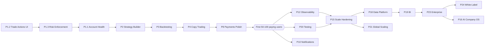

# Profytron — Master Roadmap (Strategic Document)

**Date:** 2026-06-18
**Type:** Strategy / planning document (no code changes).
**Scope:** All 25 phases of the product-completion roadmap, mapped against the *actual* codebase.
**Companion reports:** [PRODUCT_GAP_REPORT.md](PRODUCT_GAP_REPORT.md) · [SECURITY_AUDIT_STATUS.md](SECURITY_AUDIT_STATUS.md) · [PERFORMANCE_AUDIT_REPORT.md](PERFORMANCE_AUDIT_REPORT.md) · [PRODUCTION_DEPLOYMENT_GUIDE.md](PRODUCTION_DEPLOYMENT_GUIDE.md) · [apps/web/docs/SEO-AUDIT-REPORT.md](apps/web/docs/SEO-AUDIT-REPORT.md)

---

## 1. Executive Summary

Profytron is **not a greenfield project**. It is a **~75-80% complete** algorithmic-trading platform with a real backend (32 NestJS modules, BullMQ queues, MetaApi MT4/MT5 integration, copy-factory, marketplace, payments, AI agent framework) and a polished Next.js 16 frontend (~14 live dashboard features, WebSocket realtime, 32-component UI library).

The 25-phase roadmap below is therefore **mostly a "finish + harden + scale" exercise, not a "build from zero" one.** The single most valuable thing you can do is finish the handful of genuinely incomplete revenue-critical features and get the first 50-100 paying customers. Everything after that is funded and guided by real revenue.

### The core thesis: build steps 1-7 first

> Do **not** start AI company agents, mobile apps, white-label, or global scaling yet. Finish the **trading product loop** (connect → trade → automate → backtest → copy → pay) and ship it to paying users. The rest becomes far easier once revenue and user feedback exist.

### Milestone targets

| Milestone | Goal | Primary focus |
|-----------|------|---------------|
| **1,000 users** | Product-market fit | Finish trading loop, fix risk engine, ship Strategy Builder + backtesting |
| **10,000 users** | Strong recurring revenue | Copy-trading at scale, payments polish, observability, CD pipeline |
| **100,000 users** | Market leader | Multi-region infra, queue/DB scaling, data platform, partner ecosystem |
| **1,000,000 users** | Enterprise SaaS company | White-label, enterprise features, AI ops, global edge |

---

## 2. Current-State Baseline

Reconciling the optimistic root reports (which claim "PRODUCTION READY") against the more credible trackers:

| System | % Complete | Honest headline |
|--------|-----------|-----------------|
| **Frontend** (`apps/web`) | ~80% | Polished, live-API + WebSocket data, loading/error states. Strategy Builder is the one true placeholder. |
| **Backend** (`apps/api`) | ~80% | 32 modules, MetaApi MT4/MT5, BullMQ `trade_execution`/`copyfactory_sync`/`agent_workforce`, payments, analytics, AI agents. |
| **Database** (Prisma) | 7/10 | 43 models, 10 migrations, perf indexes added. No Backtest/StrategyVersion tables. |
| **Infrastructure** | 5/10 | Docker compose (local), dual-mode Redis, CI for test + security. **No CD, no observability beyond Sentry, single DB/Redis.** |
| **Security** | ~44% fixed | [SECURITY_AUDIT_STATUS.md](SECURITY_AUDIT_STATUS.md): 32 issues found, 14 fixed, 18 pending (3 critical). This contradicts the "production ready" banners — treat **44%** as the real number. |

**Credibility note:** `README_AUDIT_START_HERE.md`, `COMPLETE_AUDIT_SUMMARY.md`, and `ENTERPRISE_PRODUCTION_HARDENING_COMPLETE.md` assert "production ready / SOC2 / 99.99%". These are aspirational. The trustworthy baselines are [PRODUCT_GAP_REPORT.md](PRODUCT_GAP_REPORT.md) (75-80% complete) and [SECURITY_AUDIT_STATUS.md](SECURITY_AUDIT_STATUS.md) (44% security complete).

---

## 3. Per-Phase Breakdown (Phases 0-25)

> Legend: ✅ Done · 🟡 Partial · 🟥 Stub/placeholder · ❌ Missing
> Effort: **S** (days) · **M** (1-2 wks) · **L** (3-6 wks) · **XL** (quarter+)

### Foundation (Phases 0-1)

#### Phase 0 — Current Audit · ✅ Done · S
- **Exists:** [PRODUCT_GAP_REPORT.md](PRODUCT_GAP_REPORT.md), [PERFORMANCE_AUDIT_REPORT.md](PERFORMANCE_AUDIT_REPORT.md), [SECURITY_AUDIT_STATUS.md](SECURITY_AUDIT_STATUS.md), [apps/web/docs/SEO-AUDIT-REPORT.md](apps/web/docs/SEO-AUDIT-REPORT.md).
- **Gap:** None. This roadmap completes the Phase 0 synthesis.

#### Phase 1 — Complete Trading Core · 🟡 Partial · L
The most important phase. The plumbing exists; the user-facing actions and enforcement do not.

| Module | State | Exists | Gap |
|--------|-------|--------|-----|
| 1.1 Account Management | 🟡 | `modules/broker/broker.controller.ts` (connect/list/test), `adapters/metatrader.adapter.ts` (MT4/MT5), `adapters/paper.adapter.ts` | Disconnect/reconnect endpoints, **configurable sync interval** (currently fixed 3s in `master-sync.service.ts`), **account health monitoring** (disconnect/margin/broker-down detection) |
| 1.2 Trade Management | 🟥 | Backend actions exist: `trading.controller.ts` (place/close/bulk-close/break-even/trailing-stop). `trade-actions.dto.ts`, `pnl.util.ts`, `trailing-stop.service.ts` recently added | **Frontend trade-action UI is missing** — positions are read-only. No manual order-entry form. No partial-close/modify UI. |
| 1.3 Risk Management | 🟥 | `modules/ai-risk` exists | **Risk engine flags but never acts.** Auto-stop on max-drawdown / daily-loss / margin-danger / disconnect is not enforced. Position-sizing (fixed/%/dynamic) and daily/weekly/monthly limits not editable. |

**Why this is #1:** without enforced risk + trade actions, the product is a read-only dashboard, not a trading tool.

### Product Engine (Phases 2-7)

#### Phase 2 — Visual Strategy Builder · 🟥 Stub · L
- **Exists:** `apps/web/src/lib/stores/useBuilderStore.ts` — complete reactflow Zustand store (nodes/edges, `onConnect`, undo/redo, `addNodeFromPalette`, `loadTemplate`, typed `indicator|condition|action|risk` nodes). Backend `modules/strategy-builder` stores `StrategyBuilder`/`StrategyNode`/`StrategyEdge`.
- **Gap:** The page `apps/web/src/app/(dashboard)/strategies/builder/page.tsx` is a **"Coming soon" placeholder** — the store is orphaned. No `<ReactFlow>` canvas, no node palette wiring, no param panels, **no codegen** (Strategy JSON / Pine Script / MQL5). `strategy-builder` has no HTTP controller.
- **Note:** ~70% scaffolded. Highest leverage feature once trading core is done.

#### Phase 3 — Backtesting Engine · 🟡 Partial · L
- **Exists:** `services/backtest/main.py` (Python service shell). Backend `strategies` delegates backtests to it.
- **Gap:** Real engine: historical data ingestion (1m-D), metrics (Net Profit, Win Rate, Drawdown, Profit Factor, Sharpe, Recovery, Expectancy), equity/drawdown curves, monthly returns, trade distribution. No `Backtest`/`StrategyVersion` Prisma tables.

#### Phase 4 — Copy Trading · 🟡 Partial · M
- **Exists:** `modules/copy-factory` — `copy-factory.service.ts`, `copy-factory-sync.service.ts`, `copy-factory.processor.ts` (BullMQ `copyfactory_sync`), MetaApi CopyFactory integration. Frontend `copy-trading/` page is real.
- **Gap:** Scale validation (1k-10k followers), **latency tracking (<100ms target)**, follower risk-multiplier/fixed-lot/percentage UI polish, master performance attribution.

#### Phase 5 — Marketplace · ✅ Mostly done · S
- **Exists:** `modules/marketplace` (listings, featured, analytics, subscribe, reviews/replies), `strategy-analytics.builder.ts`, frontend list + `[id]` + checkout success.
- **Gap:** Upload/sell/rent flows for creators, configurable revenue split UI, payouts to creators (ties to wallet).

#### Phase 6 — AI Coach · 🟡 Partial · M
- **Exists:** `modules/ai/ai.controller.ts` (explain trade, chat, coaching report, market regime), `ai.service.ts`. Frontend `ai-coach/` real. AI agent framework in `modules/agents`.
- **Gap:** Replace hardcoded demo scores, structured per-trade entry/exit/risk/psychology analysis, scheduled daily/weekly/monthly reviews wired to real data.

#### Phase 7 — Advanced Analytics · ✅ Mostly done · S
- **Exists:** `modules/analytics` (portfolio, monthly-returns, strategy-comparison, risk, trades, CSV/tax export, global, leaderboard), Redis-cached. Frontend `analytics/{performance,risk,trade,global}`.
- **Gap:** VaR, Sortino, best/worst hours & symbols (behavioral analytics).

### Reach (Phases 8-13)

#### Phase 8 — Payments · 🟡 Partial · S
- **Exists:** `modules/payments` (Stripe + Razorpay webhooks, orders, subscription activation, wallet credit, invoices, plans), frontend Razorpay components.
- **Gap:** Stripe **frontend** (currently Razorpay-only in UI), coupons, trials, upgrades/downgrades/refunds flows.

#### Phase 9 — Mobile Apps · 🟥 PWA-only · XL
- **Exists:** `apps/web/public/manifest.json` (installable PWA, app shortcuts).
- **Gap:** No service worker/offline, no Capacitor/React Native. Native shell is greenfield. **Recommendation: ship PWA + add Capacitor wrapper before native rewrite.**

#### Phase 10 — Notification System · 🟡 Partial · M
- **Exists:** `modules/notifications` (`notifications.service.ts`, `fcm.service.ts`), `email/email.service.ts` (Resend), `telegram/telegram-bot.service.ts`, WebSocket `new_notification`.
- **Gap:** SMS, WhatsApp, Discord channels; unified event → channel routing for all events (margin/drawdown/expiry).

#### Phase 11 — Enterprise Infra (Event-Driven) · 🟡 Partial · M
- **Exists:** BullMQ queues, Redis caching (`analytics`, `leaderboard`, `feature-flags`, `market`), `AgentEventOutbox` outbox pattern, `config/redis.config.ts` (Upstash-aware).
- **Gap:** Formalize event bus, dead-letter handling everywhere (exists for agents), cache strategy for dashboard/market data at scale.

#### Phase 12 — Observability · 🟥 Sentry-only · M
- **Exists:** Sentry (web + API), Winston logging.
- **Gap:** **No OpenTelemetry, Prometheus, or Grafana.** No metrics endpoint. API/DB latency, memory/CPU dashboards missing.

#### Phase 13 — Customer Acquisition · 🟡 Partial · L (content-heavy)
- **Exists:** SEO foundation ([apps/web/docs/SEO-AUDIT-REPORT.md](apps/web/docs/SEO-AUDIT-REPORT.md)), blog system, sitemap/robots, schema.
- **Gap:** 100+ landing pages, 500+ SEO articles, 200+ tutorials, 100+ videos (ongoing content engine, not a code task).

### Business & Scale (Phases 14-25)

| Phase | Title | Status | Effort | Note |
|-------|-------|--------|--------|------|
| 14 | Monetization (₹999/₹2999/₹9999/Enterprise) | 🟡 | S | Plans modeled (`SubscriptionPlan`); align tiers + gating. Note: roadmap pricing (₹999/₹2999/₹9999) differs from current marketing pricing — reconcile. |
| 15 | Scale to 100K users | 🟥 | XL | Single DB/Redis today; need read replicas, queue scaling, autoscaling, LB, DR. |
| 16 | AI Company Operating System (CEO/CTO/Frontend/Backend/Security/DevOps/SEO/Content/Support agents) | 🟡 | XL | `modules/agents` framework exists (router, executor, scheduler, budget, DLQ). Extend to org-role agents emitting `CEO_REPORT.md` etc. **Defer until post-revenue.** |
| 17 | Complete Documentation System | 🟡 | M | Some docs exist; need user/dev/internal (SOPs, runbooks, incident guides). |
| 18 | Data Platform (PostgreSQL + ClickHouse + Redis) | 🟥 | L | `DailyMetricsSnapshot` exists; no ClickHouse/warehouse. |
| 19 | Business Intelligence (MRR/ARR/CAC/LTV/Churn) | 🟥 | M | No BI dashboards. Depends on Phase 18. |
| 20 | Automated Testing (95%+) | 🟥 | L | ~14 spec files vs 30+ modules; Playwright + Jest exist, no k6, e2e not in CI. |
| 21 | Global Scaling (IN/UAE/SG/EU/US) | 🟥 | XL | CDN/edge/regional DB/geo-routing. Depends on 15. |
| 22 | Partner Ecosystem (Broker/Affiliate/Influencer portals) | 🟡 | L | `modules/affiliates` + `Affiliate` model exist; portals missing. |
| 23 | Enterprise Features (teams/RBAC/audit/SSO/API/white-label hooks) | 🟡 | L | `AuditLog`, `ApiKey`, roles exist; SSO/teams missing. |
| 24 | White-Label System | 🟥 | XL | Greenfield; depends on 23. |
| 25 | Exit / Scale Strategy | 🟡 | — | Strategy/narrative; the milestone gates in §5 cover this. |

---

## 4. Prioritized Build Order

### Critical path to first 50-100 paying customers
The product loop must work end-to-end. In order:

1. **Phase 1.2 — Trade action UI** (S-M): wire close/partial/modify/break-even/trailing to existing backend. *Highest ROI: backend already exists.*
2. **Phase 1.3 — Risk auto-enforcement** (M): make `ai-risk` actually stop trading on limits. *Trust + safety blocker.*
3. **Phase 1.1 — Account health + configurable sync** (M): disconnect detection, sync interval setting.
4. **Phase 2 — Strategy Builder** (L): wire `useBuilderStore` to a real reactflow canvas + param panels + JSON codegen. *The flagship differentiator; 70% scaffolded.*
5. **Phase 3 — Backtesting** (L): build `services/backtest` into a real engine + add `Backtest` tables.
6. **Phase 4 — Copy trading polish** (M): latency tracking, follower controls.
7. **Phase 8 — Payments polish** (S): coupons/trials/upgrades so you can actually charge.

### Post-revenue sequence (10K+)
Observability (12) → CD pipeline (infra) → Testing (20) → Notifications (10) → Marketplace creator flows (5) → AI Coach depth (6) → Mobile/Capacitor (9).

### Scale sequence (100K+)
Data platform (18) → BI (19) → Scale hardening (15) → Partner ecosystem (22) → Enterprise (23) → Global (21) → White-label (24) → AI Company OS (16).

---

## 5. Milestone Gates

What must be true before you cross each threshold:

### 1,000 users — Product-Market Fit
- Trade actions + risk enforcement live (Phases 1.2, 1.3).
- Strategy Builder + backtesting usable (Phases 2, 3).
- Payments working with trials (Phase 8).
- Sentry monitoring + daily DB backups.
- Single region is fine.

### 10,000 users — Strong Recurring Revenue
- Observability (OTel + Prometheus + Grafana) — Phase 12.
- CD pipeline (no manual deploys) + staging environment.
- Test coverage 70%+, e2e in CI — Phase 20.
- Redis/queue capacity validated; copy-trading latency <100ms — Phase 4.
- Read replica for analytics reads.

### 100,000 users — Market Leader
- DB partitioning/sharding plan for `Trade` table; connection pooling (PgBouncer).
- Data warehouse (ClickHouse) + BI dashboards — Phases 18, 19.
- Multi-region readiness, CDN/edge — Phase 21.
- Partner + affiliate portals — Phase 22.
- On-call rotation + incident runbooks — Phase 17.

### 1,000,000 users — Enterprise SaaS
- White-label + enterprise (SSO, teams, RBAC) — Phases 23, 24.
- AI company operating system automating ops — Phase 16.
- Global edge, geo-routing, DR with RPO/RTO targets — Phase 21.

---

## 6. Risk Register

| # | Risk | Severity | Phase that fixes it |
|---|------|----------|---------------------|
| R1 | **Risk engine is inert** — flags but never stops trading. Real-money loss exposure. | 🟥 Critical | 1.3 |
| R2 | **3 critical security issues open** ([SECURITY_AUDIT_STATUS.md](SECURITY_AUDIT_STATUS.md), 44% complete) despite "production ready" claims. | 🟥 Critical | Security backlog (pre-1K) |
| R3 | **No CD pipeline** — manual deploys, no staging. High change-failure risk. | 🟠 High | Pre-10K infra |
| R4 | **Single DB / single Redis** — no replicas, partitioning, or failover. | 🟠 High | 15 |
| R5 | **Observability blind spot** — only Sentry; no latency/resource metrics. | 🟠 High | 12 |
| R6 | **Thin test coverage** (~14 specs / 30+ modules), e2e not in CI. | 🟠 High | 20 |
| R7 | **Strategy Builder placeholder** — flagship feature not shipped. | 🟡 Medium | 2 |
| R8 | **Broken Semgrep SARIF upload** in `security.yml` (outputs JSON, uploads as SARIF). | 🟡 Medium | CI fix (S) |
| R9 | **Pricing mismatch** — roadmap tiers (₹999/₹2999/₹9999) vs current marketing pricing. | 🟡 Medium | 14 |
| R10 | **Backtest engine delegated to a Python service** that is a shell (`services/backtest/main.py`). | 🟡 Medium | 3 |

---

## 7. Zero-Budget API Keys & Services ($0 to start)

You said you have no money. Good news: every external dependency Profytron uses has a free tier sufficient to launch and reach your first paying users. Use these, then upgrade only when revenue demands it.

### Required to run the core product

| Service | Used for | Free tier | Where it's configured |
|---------|----------|-----------|----------------------|
| **Neon** (PostgreSQL) | Primary database | 0.5 GB storage, autosuspend — free forever | `DATABASE_URL` |
| **Upstash Redis** | Queues (BullMQ) + cache + sessions | 10K commands/day free; REST/rediss supported | `config/redis.config.ts` (`REDIS_URL`) |
| **Supabase** | Auth (email/OAuth), storage | 50K MAU, 500 MB DB, 1 GB storage free | `SUPABASE_*` env vars |
| **Vercel** | Frontend hosting (Next.js) | Hobby tier free (non-commercial caveat — see note) | `apps/web` |
| **Render** or **Railway** or **Fly.io** | API (NestJS) hosting | Render free web service (sleeps), Fly free allowance, Railway $5 trial credit | `apps/api/Dockerfile` |
| **Sentry** | Error monitoring | 5K errors/mo, 1 user free | `sentry.*.config.ts` |

### Trading & market data

| Service | Used for | Free tier | Notes |
|---------|----------|-----------|-------|
| **MetaApi** | MT4/MT5 connectivity + CopyFactory | Free dev tier / trial; pay-per-account after | `METAAPI_TOKEN`. Until set, adapters return labelled mocks — **you can build the whole UI for free** with paper trading. |
| **TwelveData** | Market quotes | 800 requests/day free, 8 symbols | `market` module; synthetic fallback already exists |
| **Paper/Demo broker** | Testing | Free (built-in) | `adapters/paper.adapter.ts` |

### AI (Phase 6 / Coach / agents)

| Service | Used for | Free tier | Notes |
|---------|----------|-----------|-------|
| **OpenRouter** | LLM routing (already used) | Has free models (e.g. some `:free` variants) | `ai.service.ts` / `model-router.service.ts` |
| **Google AI Studio (Gemini)** | LLM | Generous free tier (Gemini Flash) | Cheapest path for coaching/analysis |
| **Groq** | Fast LLM inference | Free tier, very fast | Good for chat |

### Payments

| Service | Used for | Free tier | Notes |
|---------|----------|-----------|-------|
| **Razorpay** | INR payments (primary) | No monthly fee; per-transaction % only — **₹0 to integrate** | Already wired; demo mode exists (`RAZORPAY_KEY_ID=DEMO_KEY`) |
| **Stripe** | International | No monthly fee; per-transaction % only | Backend wired; frontend pending |

### Notifications

| Service | Used for | Free tier | Notes |
|---------|----------|-----------|-------|
| **Resend** | Transactional email | 3,000 emails/mo, 100/day free | `email.service.ts` |
| **Firebase Cloud Messaging** | Push notifications | Free | `fcm.service.ts` |
| **Telegram Bot API** | Telegram alerts | Free | `telegram-bot.service.ts` |
| **Discord Webhooks** | Discord alerts | Free | Phase 10 |

### Observability & CI (Phase 12, 20)

| Service | Used for | Free tier | Notes |
|---------|----------|-----------|-------|
| **GitHub Actions** | CI | 2,000 min/mo free (public repos unlimited) | `.github/workflows/` |
| **Grafana Cloud** | Metrics/dashboards | Free tier (10K series, 50 GB logs) | Phase 12 |
| **Better Stack / Uptime Robot** | Uptime monitoring | Free tier | New |
| **PostHog** | Product analytics | 1M events/mo free | Already a web dependency |

### $0 launch stack (recommended)
**Neon + Upstash + Supabase + Vercel (web) + Render/Fly (API) + Razorpay (demo→live) + OpenRouter free models + Resend + Sentry + PostHog.**
This runs the entire product loop end-to-end for first users at **₹0/month** in fixed costs (you only pay payment-processor % on actual revenue, and MetaApi per-account once you go live beyond paper trading).

> Vercel Hobby caveat: technically non-commercial. For a revenue product, either run web on Render/Netlify free tier too, or move to Vercel Pro once you have revenue.

---

## 8. Summary

- **You are 75-80% done.** Stop building breadth; finish depth on the trading loop.
- **Critical path:** trade actions UI → risk enforcement → strategy builder → backtesting → copy-trading polish → payments. Ship to paying users.
- **Fix before launch:** R1 (inert risk engine) and R2 (3 critical security issues) are non-negotiable for a real-money product.
- **Everything is buildable at $0** until you have revenue (see §7).
- **Defer** AI company OS, white-label, global scaling, and native mobile until post-revenue — they are XL efforts with no value before product-market fit.
