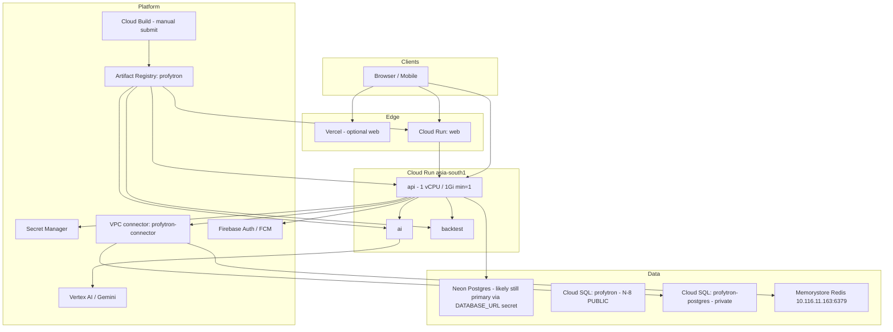

# Profytron — Google Cloud Architecture Report

> Generated via `gcloud` CLI only (no Console). Project: `gen-lang-client-0497144011` · Region: `asia-south1` · Account: `abhiaj371@gmail.com`

---

## 1. Executive summary

Profytron already runs as a **Cloud Run + Artifact Registry + Secret Manager + Memorystore + Cloud SQL** platform in `asia-south1`, with Cloud Build YAML configs in-repo and Firebase/Vertex/Gemini APIs enabled.

**What is solid today**
- 4 Cloud Run services live (`api`, `web`, `ai`, `backtest`)
- Artifact Registry repo `profytron` (Docker)
- Memorystore Redis `profytron-redis` (BASIC 1GB) + VPC connector `profytron-connector`
- Secret Manager extensively used (~80+ secrets)
- Billing enabled + budget `Profytron GCP Credits` (₹24,900)
- ~23 Cloud Monitoring alert policies
- Cloud Build deployer + VPS provisioner service accounts

**Critical gaps / risks**
1. **Two Cloud SQL instances are both RUNNABLE** — `profytron` (`db-perf-optimized-N-8`, 100GB, public IP, SSL optional, **backups OFF**) and `profytron-postgres` (`db-custom-1-3840`, private IP). This is the #1 FinOps and security issue.
2. **No Cloud Build triggers** — deploys are manual `gcloud builds submit`.
3. **No Terraform** — infra is script + Cloud Build YAML only; not fully reproducible.
4. **No Pub/Sub topics / Scheduler jobs** provisioned (app may use in-process Nest `@Cron` + Bull instead).
5. **Only one GCS bucket** (`*_cloudbuild`) — no lifecycle-managed buckets for uploads/backups/exports.
6. **Web may also deploy to Vercel** (repo has `vercel.json`) — dual-frontend path to reconcile.

---

## 2. Current architecture (as discovered)



### Cloud Run services

| Service | URL | Notes |
|---------|-----|--------|
| `api` | https://api-y4zmug7lwa-el.a.run.app | 1 CPU / 1Gi, min=1, max=10, no CPU throttle, VPC connector, secrets from SM |
| `web` | https://web-y4zmug7lwa-el.a.run.app | Next.js container |
| `ai` | https://ai-y4zmug7lwa-el.a.run.app | Python AI service |
| `backtest` | https://backtest-y4zmug7lwa-el.a.run.app | Python backtest |

### Data plane

| Resource | Status | Notes |
|----------|--------|--------|
| Memorystore `profytron-redis` | READY | BASIC 1GB, host `10.116.11.163:6379` |
| VPC connector `profytron-connector` | READY | `10.8.0.0/28` on `default` network |
| Cloud SQL `profytron` | RUNNABLE | **POSTGRES_18 / db-perf-optimized-N-8 / 100GB / public IP / backups disabled / SSL not required** |
| Cloud SQL `profytron-postgres` | RUNNABLE | POSTGRES_17 / db-custom-1-3840 / private IP / 10GB — matches `provision-cloudsql.sh` |
| Neon | External | Still referenced by app secrets / Prisma (`DATABASE_URL` with `-pooler`) |

### Identity & secrets

- Service accounts: `cloud-build-deployer`, `vps-provisioner`, `firebase-auth-verifier`, Firebase Admin SDK, default compute
- Secrets: 80+ including JWT, MetaAPI, Stripe, Firebase, Gemini, Redis, Cloud SQL passwords

### CI/CD today

| Config | Purpose |
|--------|---------|
| `cloudbuild-api.yaml` | Build API image → Artifact Registry → Cloud Run deploy + secrets |
| `cloudbuild-web.yaml` | Build Next with public env build-args → deploy `web` |
| `cloudbuild-ai.yaml` | AI service |
| `cloudbuild-backtest.yaml` | Backtest service |
| Triggers | **None** |

### Repo deploy assets

- `deploy/gcp/provision-cloudsql.sh`
- `deploy/gcp/provision-memorystore.sh`
- `deploy/k8s/*` (GKE manifests exist but GKE cluster not confirmed as primary runtime)
- `deploy/ecs/*` (AWS path — alternate)

---

## 3. Enabled APIs (high-signal subset)

Already enabled (non-exhaustive): Cloud Run, Cloud Build, Artifact Registry, Secret Manager, Logging, Monitoring, Trace, Compute, Container (GKE API), Redis, SQL Admin, Storage, Pub/Sub, Scheduler, IAM, Firebase suite, Firestore, Identity Toolkit, Vertex AI (`aiplatform`), Generative Language, DNS, Security Command Center, Text-to-Speech, BigQuery, VPC Access, Service Networking.

**Useful but currently DISABLED** (safe to enable — low/no idle cost):

| API | Why | Idle cost |
|-----|-----|-----------|
| `cloudtasks.googleapis.com` | Background jobs / retries | Pay per task |
| `eventarc.googleapis.com` | Event-driven wiring | Pay per event |
| `clouderrorreporting.googleapis.com` | Error grouping | Free tier + log-based |
| `cloudprofiler.googleapis.com` | CPU/heap profiles | Free for Cloud Run quotas |
| `certificatemanager.googleapis.com` | Managed certs for LB/CDN | Free for Google-managed |
| `networkmanagement.googleapis.com` | Connectivity tests | Pay per test |

**Do NOT enable “because we can”** (cost or unused): Cloud Armor (policy fees), Vision/Video Intelligence, Speech-to-Text (unless product needs), Maps, Document AI, Notebooks idle VMs, second GKE cluster.

---

## 4. Cost / FinOps findings (priority order)

| Priority | Finding | Est. impact | Action |
|----------|---------|-------------|--------|
| **P0** | `profytron` Cloud SQL `db-perf-optimized-N-8` + 100GB disk running | Often **$200–600+/mo** depending on CUDs | Confirm if Neon is still source of truth; if unused → stop/delete after snapshot |
| **P0** | Backups **disabled** on `profytron` | Data-loss risk | Enable automated backups + PITR before any cutover |
| **P0** | Public IP + `ALLOW_UNENCRYPTED_AND_ENCRYPTED` on `profytron` | Security risk | Prefer private-IP instance (`profytron-postgres`) |
| **P1** | Duplicate SQL instances | Paying twice | Keep one; delete the other after cutover |
| **P1** | Cloud Run `api` `min-instances=1` | Always-on ~$30–50/mo | Keep for trading latency; document tradeoff |
| **P2** | BASIC Redis (no HA) | Cheap but single-AZ | Upgrade to STANDARD_HA only when SLOs demand it |
| **OK** | Budget ₹24,900 exists | Good | Add threshold alerts at 50/80/100% if missing |

---

## 5. Target platform (CLI-managed)

```
Terraform (IaC)
  ├─ APIs (selective)
  ├─ Artifact Registry
  ├─ Cloud Run services (api/web/ai/backtest)
  ├─ VPC connector + Memorystore
  ├─ Cloud SQL (single private instance)
  ├─ Secret Manager IAM bindings
  ├─ GCS buckets + lifecycle
  ├─ Pub/Sub + Cloud Tasks + Scheduler
  ├─ Monitoring dashboards + uptime checks
  └─ Budget alerts

Cloud Build triggers (GitHub)
  └─ build → scan → push → deploy → health → auto-rollback

Scripts (PowerShell + Bash)
  └─ setup / deploy / health / rollback / cost-audit / enable-apis
```

---

## 6. Production readiness checklist

- [ ] Decide single database source of truth (Neon vs Cloud SQL) and delete idle SQL
- [ ] Enable Cloud SQL backups + PITR on the chosen instance
- [ ] Enforce SSL / private IP only for SQL
- [ ] Add Cloud Build triggers for `main`
- [ ] Import live resources into Terraform state (`terraform import`)
- [ ] Create dedicated buckets: uploads, backups, exports, static
- [ ] Wire Cloud Tasks for PDF statements / AI jobs / email
- [ ] Uptime checks on `/health` for `api` and `web`
- [ ] Document disaster recovery (SQL dump + Secret Manager restore + Run rollback)
- [ ] Reconcile Vercel vs Cloud Run `web` ownership

---

## 7. Console-only exceptions (rare)

These typically still need a human in the Console / external portals once:

- Creating the first billing account / accepting some Terms of Service
- OAuth consent screen branding (Google Cloud Auth Platform)
- Some Firebase Hosting custom-domain DNS verification UX
- Purchasing domains (Cloud Domains can be CLI, but registrars vary)

Everything else in this report is CLI-capable.

---

## 8. Next commands (run from repo root)

Full CLI runbooks: [`RUNBOOKS.md`](./RUNBOOKS.md)

```powershell
# One-shot: inventory + cost + health + IAM
.\deploy\gcp\scripts\setup.ps1

# Or individually:
.\deploy\gcp\scripts\gcp-inventory.ps1
.\deploy\gcp\scripts\enable-apis.ps1      # optional low-cost APIs
.\deploy\gcp\scripts\cost-audit.ps1
.\deploy\gcp\scripts\health.ps1
.\deploy\gcp\scripts\iam-audit.ps1
.\deploy\gcp\scripts\deploy.ps1 -Service api
.\deploy\gcp\scripts\rollback.ps1 -Service api -Revision <rev>

# Terraform (buckets / Pub/Sub / Tasks / AR) — import first
cd deploy\gcp\terraform; terraform init; terraform plan
```

## 9. Decision required before more infra spend

**Pick one database source of truth**, then stop/delete the other Cloud SQL instance:

| Option | Pros | Cons |
|--------|------|------|
| Keep **Neon** | Already in Prisma secrets; managed pooling | Dual-cloud ops |
| Keep **`profytron-postgres`** (private) | VPC-native; matches provision scripts | Migration + cutover |
| Keep **`profytron`** (N-8 public) | Powerful | Highest cost; public IP; backups off |

Do **not** `terraform apply` Cloud SQL until this is decided.
