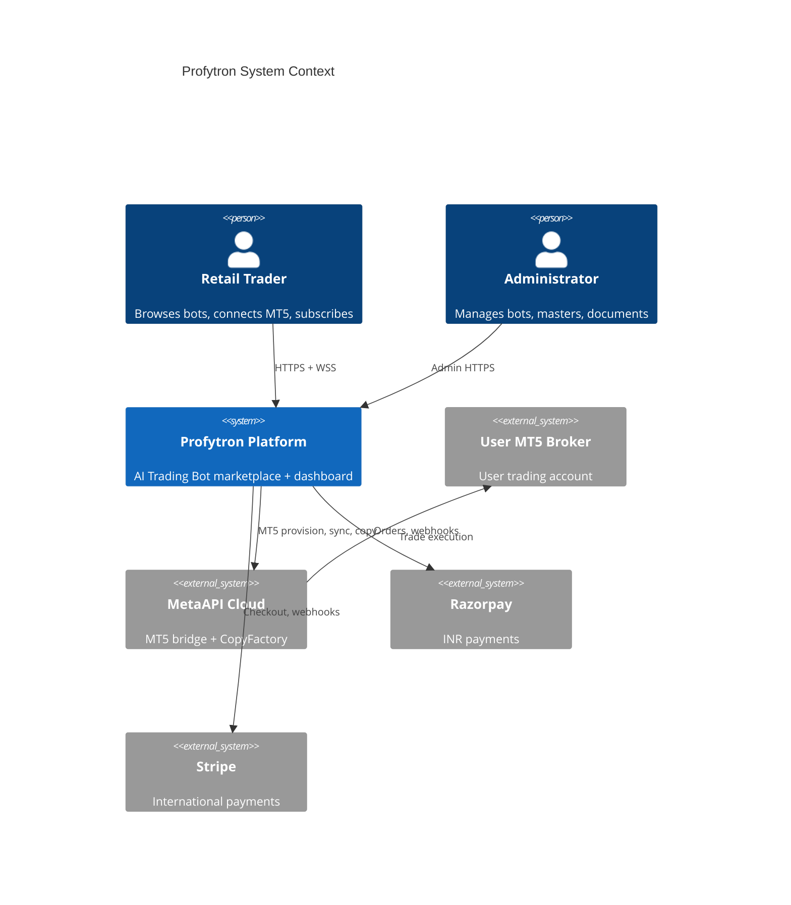
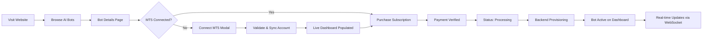
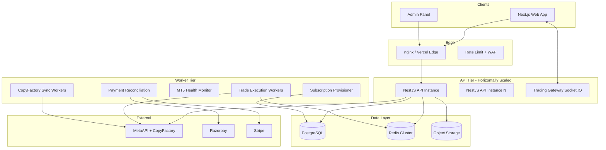
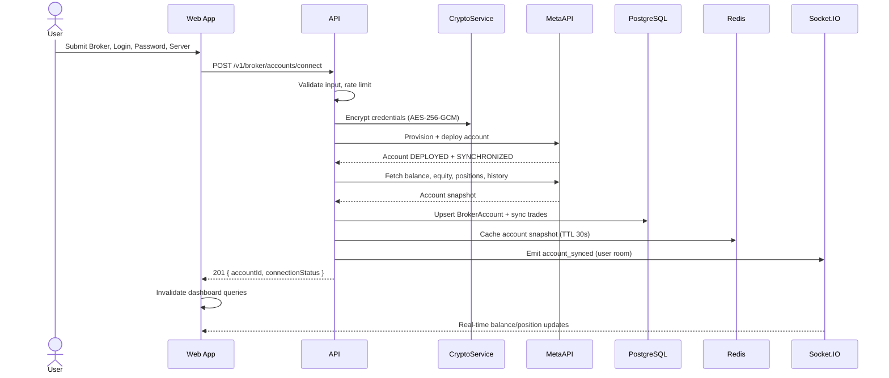
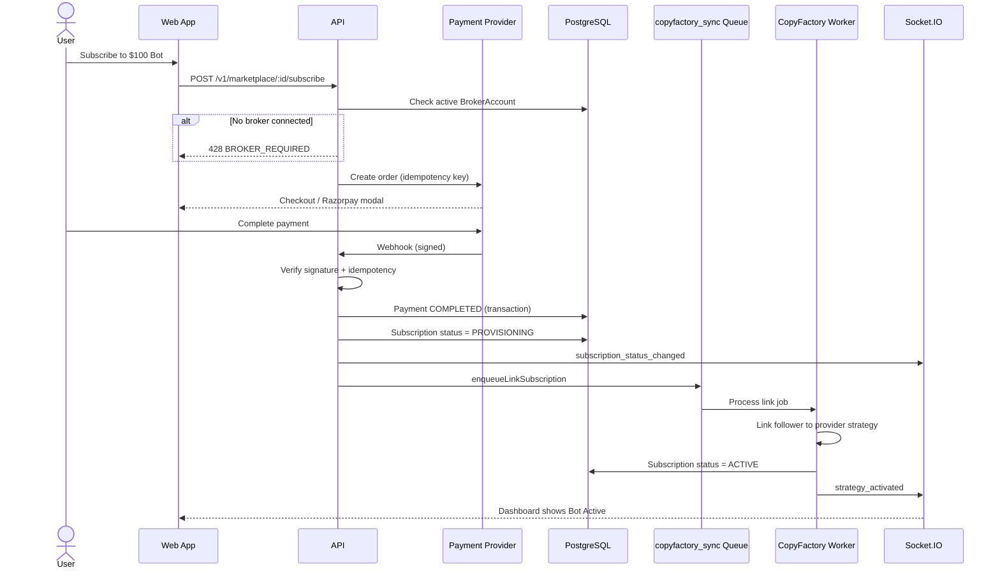
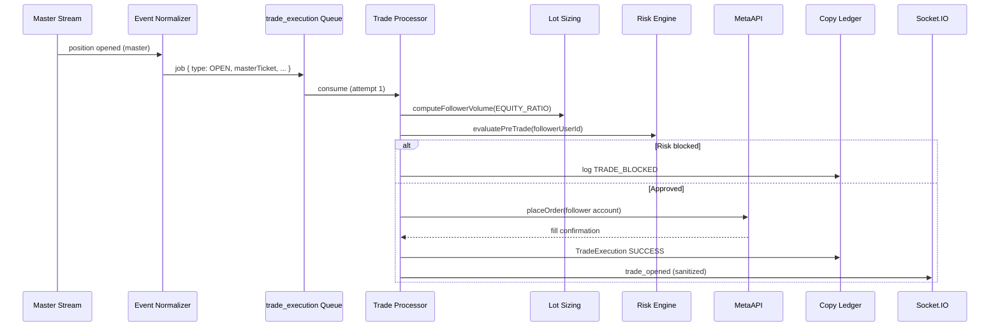
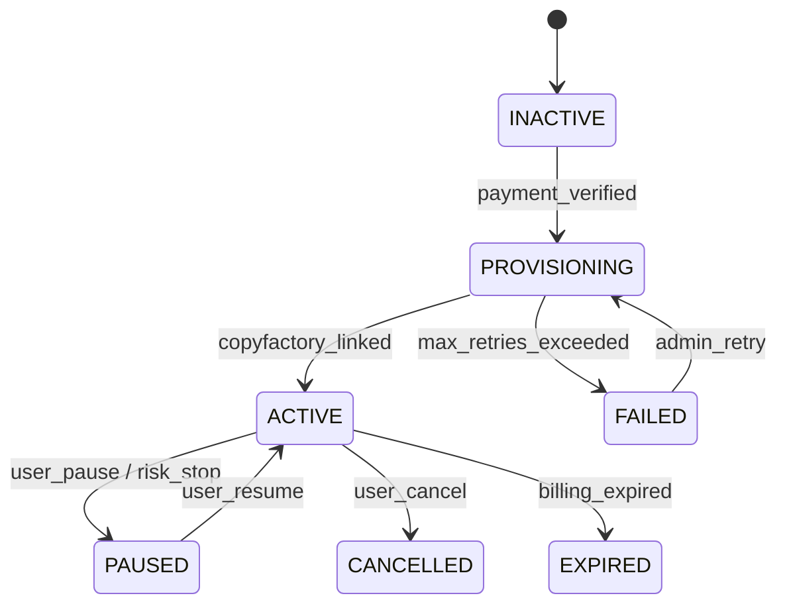

# Profytron Enterprise AI Trading Bot Platform — Technical Architecture

**Version:** 1.0  
**Date:** 2026-07-09  
**Status:** Architecture specification (pre-implementation)  
**Scope:** Production-grade backend for real-money trading at 10,000+ concurrent users, with hidden copy-trading execution. **No frontend UI/UX redesign.**

---

## Table of Contents

1. [Executive Summary](#1-executive-summary)
2. [Ambiguities, Risks & Required Decisions](#2-ambiguities-risks--required-decisions)
3. [Current State vs Target State](#3-current-state-vs-target-state)
4. [System Context & Principles](#4-system-context--principles)
5. [Component Architecture](#5-component-architecture)
6. [Sequence Flows](#6-sequence-flows)
7. [Data Flow Descriptions](#7-data-flow-descriptions)
8. [Database Schema Recommendations](#8-database-schema-recommendations)
9. [Queue & Event Bus Architecture](#9-queue--event-bus-architecture)
10. [Event Lifecycle (Copy Engine)](#10-event-lifecycle-copy-engine)
11. [API Contracts](#11-api-contracts)
12. [Validation Rules](#12-validation-rules)
13. [Security Architecture](#13-security-architecture)
14. [Scalability & High Availability](#14-scalability--high-availability)
15. [Failure Scenarios & Recovery](#15-failure-scenarios--recovery)
16. [Monitoring, Observability & Alerting](#16-monitoring-observability--alerting)
17. [Testing Strategy](#17-testing-strategy)
18. [Deployment & Operations](#18-deployment--operations)
19. [Implementation Phases](#19-implementation-phases)

---

## 1. Executive Summary

Profytron presents as an **AI Trading Bot platform** to end users. Internally, trade execution is delivered via a **hidden copy-trading engine** that maps each public bot plan (e.g. "$100 Bot") to one or more **internal operator MT5 accounts** (never exposed in UI, API responses, logs visible to users, or WebSocket payloads).

The platform already has a strong foundation:

| Layer | Existing stack |
|-------|----------------|
| Frontend | Next.js 16, React 19, TanStack Query, Socket.IO client |
| API | NestJS 11, Prisma 5, PostgreSQL (Neon) |
| Real-time | Socket.IO + Redis adapter |
| Queues | BullMQ (trade_execution, copyfactory_sync, DLQ) |
| MT5 bridge | MetaAPI + CopyFactory SDK |
| Payments | Razorpay (INR primary), Stripe |
| Auth | JWT + refresh rotation, OAuth, 2FA |
| Encryption | AES-256-GCM for broker credentials |

This document defines the **target enterprise architecture** to close production gaps while preserving all existing screens, layouts, branding, colors, navigation, and user journeys.

**Core architectural decision:** Use a **dual-path execution model** with a single user-facing abstraction:

```
User sees:  "AI Bot" → Subscription → Live Dashboard
Backend:    Strategy → Hidden Master MT5 → Event Bus → Follower MT5 (user account)
```

---

## 2. Ambiguities, Risks & Required Decisions

> **STOP:** The following items must be resolved (or accepted with documented risk) before production code ships.

### 2.1 Execution Provider: MetaAPI CopyFactory vs Custom Copy Engine

| Item | Ambiguity | Impact | Safest recommendation |
|------|-----------|--------|----------------------|
| **Dual execution paths** | Codebase has both `CopyFactorySyncService` (MetaAPI CopyFactory SDK) and `MasterSyncService` (custom poll + BullMQ fan-out). | Duplicate trades, inconsistent lot sizing, divergent SL/TP behavior, impossible debugging. | **Single primary path per environment.** Production: MetaAPI CopyFactory for broker-grade replication latency + custom engine as **fallback only** when CopyFactory is disabled. Enforce via feature flag `COPY_EXECUTION_MODE=copyfactory|custom|hybrid`. Hybrid is **not recommended** for production. |
| **Polling vs streaming** | `MasterSyncService` polls every 3s; user requires event-driven, no inefficient polling. | 3–6s replication delay; missed sub-second modifications under load. | Upgrade master detection to **MetaAPI streaming synchronization** (WebSocket). Retain Redis snapshot diff logic; replace poll loop with stream callbacks. Polling becomes health-check fallback only. |

### 2.2 Provisioning SLA (30–40 minutes)

| Item | Ambiguity | Impact | Safest recommendation |
|------|-----------|--------|----------------------|
| **Why 30–40 min?** | MetaAPI account deploy is typically 60–120s. 30–40 min suggests manual ops or CopyFactory strategy provisioning. | Users see "Processing" far longer than technically necessary OR ops miss SLA if automated. | Split states: `PROVISIONING_MT5` (≤2 min), `PROVISIONING_BOT` (CopyFactory link, ≤5 min), `ACTIVE`. Show user **"Subscription Processing"** with honest sub-status internally. If manual master assignment is required, cap queue with alerting at 35 min. |
| **No PROCESSING subscription status** | `SubscriptionStatus` enum lacks `PROVISIONING` / `PROCESSING`. | Payment succeeds → immediate `ACTIVE` even if CopyFactory link pending → user thinks bot is live when it is not. | Add `PROVISIONING` to `SubscriptionStatus`. Transition: `INACTIVE → PROVISIONING → ACTIVE | FAILED`. Emit WebSocket `subscription_status_changed`. |

### 2.3 MT5 Connection Prerequisite Before Purchase

| Item | Ambiguity | Impact | Safest recommendation |
|------|-----------|--------|----------------------|
| **Not enforced server-side** | Marketplace subscribe does not require connected MT5 account. | Payment without broker → provisioning fails → support burden, refunds. | **Hard gate:** `POST /marketplace/:id/subscribe` returns `428 Precondition Required` with `{ code: 'BROKER_REQUIRED' }` if no active `BrokerAccount` (MT5/MT4, non-paper). Frontend already has connect modals — no UI redesign, only enforce existing flow. |
| **Credential validation timing** | Connect can succeed at MetaAPI layer but broker may reject later. | False "connected" state. | Require `connectionStatus: DEPLOYED` AND `synchronizationStatus: SYNCHRONIZED` before marking broker `isActive`. Background health worker re-validates every 60s. |

### 2.4 Bot Plan → Master Account Mapping

| Item | Ambiguity | Impact | Safest recommendation |
|------|-----------|--------|----------------------|
| **Mapping visibility** | `Strategy.masterBrokerAccountId` exists but admin setup is manual (`POST /admin/setup/master-copy`). | Wrong master linked to plan → all subscribers get wrong strategy exposure. | Introduce `BotPlanTier` config table (internal): `planSlug ($100)`, `strategyId`, `masterBrokerAccountId`, `riskProfileJson`. Admin UI maps tiers without exposing "master" in user APIs — API returns `botOperatorId` internally only, never in user DTOs. |
| **Master equity drift** | User says if master grows $100→$120, raw lot copy is wrong. | Over-leveraged followers, margin calls. | Default sizing: `EQUITY_RATIO` with live equity fetch (already in `lot-sizing.util.ts`). Never use raw lot copy in production. Add `freeMargin` guard before every execution. |

### 2.5 PDF Documents on Bot Details

| Item | Ambiguity | Impact | Safest recommendation |
|------|-----------|--------|----------------------|
| **No StrategyDocument model** | Admin can parse PDF for auto-fill (`POST /admin/strategies/pdf`) but no persisted documents for bot detail pages. | Feature gap vs requirements. | Add `StrategyDocument` model + Supabase/S3 storage. Admin upload → appears on `/marketplace/[id]` via existing UI section (non-breaking: append to API response `documents[]`). |
| **Storage** | KYC uses Supabase bucket; strategy docs unspecified. | Inconsistent infra. | Reuse Supabase `strategy-documents` bucket with signed URLs (1h TTL). |

### 2.6 Payment: Razorpay vs Stripe for Bot Subscriptions

| Item | Ambiguity | Impact | Safest recommendation |
|------|-----------|--------|----------------------|
| **Stripe-first in marketplace.service** | `subscribe()` creates Stripe checkout; Razorpay used elsewhere for INR. | Indian users (₹199/mo) may hit wrong provider. | **Country-aware routing:** `country === 'IN'` → Razorpay order + verify; else Stripe. Both paths call same `activateSubscription()` with idempotency key. |
| **Platform tier gate** | Paid marketplace requires `subscriptionTier !== FREE`. | User must buy PRO platform plan before bot plan — may not match ₹199 bot-only expectation. | **Business decision required.** Safest for revenue: keep tier gate but document. Alternative: allow direct bot purchase on FREE tier (one active bot max). |

### 2.7 Terminology Leakage (Copy Trading Visibility)

| Item | Ambiguity | Impact | Safest recommendation |
|------|-----------|--------|----------------------|
| **Routes & APIs** | `/copy-trading`, `/v1/copy/*`, `copy-trading.ts`, SEO/FAQ copy. | Users discover copy trading; regulatory and trust risk. | **Backend-only rename in user DTOs** (never change URLs in this phase to avoid breaking frontend). Frontend: extend `bot-labels.ts` sanitization to API error messages, WebSocket events, and notification bodies. Deprecate `/copy-trading` route via redirect to `/my-bots` (same layout, no redesign). Admin/internal routes keep copy terminology. |
| **Analytics dataSource field** | May expose `masterBrokerAccountId` derivation. | Information leak. | User-facing analytics: `dataSource: 'live' | 'simulated'`. Never return master IDs. |

### 2.8 Regulatory & Real-Money Risk

| Item | Ambiguity | Impact | Safest recommendation |
|------|-----------|--------|----------------------|
| **Investment advisory** | Automated trade replication may require licenses in IN/EU/US. | Legal exposure. | Architecture supports audit trail (`TradeEvent`, `AuditLog`). **Product/legal must sign off** before live money. Implement kill switch (`emergency_stop`) — already exists. |
| **MetaAPI SPOF** | All MT5 traffic via MetaAPI. | Outage = no trading. | Health circuit breaker; queue trades; alert ops. Document RTO/RPO. Consider secondary bridge only if contract allows. |

### 2.9 Concurrent User Target

| Item | Ambiguity | Impact | Safest recommendation |
|------|-----------|--------|----------------------|
| **10,000 concurrent** | Means 10k WebSocket connections, or 10k active subscriptions, or 10k API RPS? | Wrong capacity planning. | Define: **10k concurrent WebSocket clients**, **50k active subscriptions**, **500 trades/min fan-out peak**. Size Redis, API replicas, MetaAPI account limits accordingly. |

---

## 3. Current State vs Target State

| Capability | Current | Target |
|------------|---------|--------|
| User-facing branding | Partial (`bot-labels.ts`) | Full sanitization of all user-visible strings |
| MT5 before subscribe | UI prompt only | Server-enforced precondition |
| Subscription provisioning | Immediate ACTIVE | PROVISIONING → ACTIVE with WS updates |
| Master event detection | 3s polling | MetaAPI streaming + event bus |
| Lot sizing | EQUITY_RATIO implemented | Default for all plans + margin guards |
| Strategy PDFs | Parse only | Upload, store, serve on bot details |
| INR bot checkout | Stripe path | Razorpay primary for IN |
| Copy terminology in APIs | `/copy/*` exposed | User DTOs use bot/automation language |
| Horizontal scale | Redis leader lock, BullMQ | Add dedicated worker tier at 10k+ |
| Observability | Sentry, health, audit | Full metrics + queue dashboards + SLOs |

---

## 4. System Context & Principles

### 4.1 Design Principles

1. **User abstraction integrity** — Users interact with "AI Trading Bots" only. Internal copy-trading is a deployment detail.
2. **Fail closed on money** — No subscription activation without verified payment. No trade without risk checks.
3. **Idempotency everywhere** — Payments, webhooks, trade execution, provisioning jobs.
4. **Event sourcing for trades** — Append-only `TradeEvent` log; projections for dashboard.
5. **Encryption at rest** — Broker credentials, refresh tokens, API secrets.
6. **Zero trust between services** — JWT scopes, internal service tokens for workers.
7. **Observable by default** — Correlation IDs from HTTP → queue → WebSocket.

### 4.2 Logical Context Diagram



### 4.3 User Journey (Preserved — No UI Changes)



---

## 5. Component Architecture

### 5.1 Container Diagram



### 5.2 Backend Module Map (NestJS)

| Module | Responsibility | User-visible? |
|--------|----------------|---------------|
| `auth` | JWT, refresh, 2FA, sessions, RBAC | Yes |
| `users` | Profile, preferences, KYC | Yes |
| `broker` | MT5 connect, encrypt creds, sync account info | Yes (as "Connect Trading Account") |
| `marketplace` | Bot catalog, details, analytics, subscribe | Yes |
| `subscriptions` | Platform tier billing | Yes |
| `payments` | Razorpay/Stripe, webhooks, idempotency | Yes |
| `trading` | Positions, orders, emergency stop, WS gateway | Yes |
| `strategies` | User's active bots (`/my-bots`) | Yes |
| `copy-factory` | **Internal** — CopyFactory link/unlink | **No** |
| `copy` | **Internal** — Master profiles, relationships | **No** (admin only) |
| `trading/master-sync` | **Internal** — Master event detection | **No** |
| `admin` | Bot CRUD, document upload, master setup | Admin only |
| `risk` | Pre-trade checks, auto-stop | Yes (as "Risk Settings") |
| `analytics` | Performance aggregation | Yes |
| `notifications` | Email, push, in-app | Yes |

### 5.3 Hidden Copy Engine (Internal)

```
┌─────────────────────────────────────────────────────────────────┐
│                    HIDDEN COPY ENGINE                            │
├─────────────────────────────────────────────────────────────────┤
│  Master Stream Listener (MetaAPI WS)                             │
│       │                                                          │
│       ▼                                                          │
│  Event Normalizer → master.trade.{opened|modified|closed|...}    │
│       │                                                          │
│       ▼                                                          │
│  Redis Streams / BullMQ (trade_execution queue)                  │
│       │                                                          │
│       ├──► Lot Sizing Engine (EQUITY_RATIO + margin guard)       │
│       ├──► Risk Engine (AiRiskService pre-trade)                 │
│       └──► Execution Adapter (MetaAPI order API)                 │
│       │                                                          │
│       ▼                                                          │
│  Copy Ledger (TradeEvent + TradeExecution)                       │
│       │                                                          │
│       ▼                                                          │
│  WebSocket Fan-out (user-scoped, sanitized payloads)             │
└─────────────────────────────────────────────────────────────────┘
```

**Bot Plan Mapping (internal config):**

| Public plan | Strategy.name | Hidden master | Sizing default |
|-------------|---------------|---------------|----------------|
| $100 Bot | `$100 Bot` | `master_100_mt5` | EQUITY_RATIO |
| $200 Bot | `$200 Bot` | `master_200_mt5` | EQUITY_RATIO |
| ₹199/mo India | Same strategy tier | Same master pool | EQUITY_RATIO |

---

## 6. Sequence Flows

### 6.1 MT5 Connection & Dashboard Sync



### 6.2 Subscription Purchase with Provisioning



### 6.3 Master Trade Replication (Event-Driven)



---

## 7. Data Flow Descriptions

### 7.1 MT5 Account Sync Pipeline

1. **Ingress:** Encrypted credentials stored in `BrokerAccount.credentialsEncrypted`.
2. **MetaAPI mapping:** JSON blob includes `metaApiAccountId`, `region`, `connectionStatus`.
3. **Sync worker (60s):** Pulls account info, positions, pending orders, history deltas.
4. **Projection:** Upsert `Trade` rows; compute daily/monthly PnL aggregates → `UserTradingSnapshot` (new).
5. **Cache:** Redis `account:{id}:snapshot` for fast dashboard reads.
6. **Egress:** WebSocket events to `user:{userId}` room only.

### 7.2 Analytics & Bot Performance

| Data type | Source | User sees |
|-----------|--------|-----------|
| Bot historical performance | `StrategyPerformance` + master account trades | Win rate, drawdown, equity curve on Bot Details |
| User live PnL | Follower account via MetaAPI | Dashboard cards |
| Bot status | `UserStrategySubscription.status` | Active / Processing / Paused |

**Rule:** Public bot analytics MUST NOT reference master account IDs. Internal jobs join on `strategy.masterBrokerAccountId`.

### 7.3 Document Flow (Admin → Bot Details)

1. Admin uploads PDF via `POST /v1/admin/strategies/:id/documents`.
2. File stored in `strategy-documents/{strategyId}/{uuid}.pdf`.
3. `StrategyDocument` row: title, fileUrl (signed), mimeType, sortOrder, isPublished.
4. `GET /v1/marketplace/:id` includes `documents[]` — existing Bot Details page renders list (no layout change).

---

## 8. Database Schema Recommendations

### 8.1 Schema Changes (Additive)

```prisma
// Extend existing enum
enum SubscriptionStatus {
  INACTIVE
  PROVISIONING   // NEW — payment verified, bot linking in progress
  ACTIVE
  PAUSED
  CANCELLED
  EXPIRED
  FAILED         // NEW — provisioning exhausted retries
}

model StrategyDocument {
  id          String   @id @default(uuid())
  strategyId  String
  strategy    Strategy @relation(fields: [strategyId], references: [id], onDelete: Cascade)
  title       String
  description String?
  storageKey  String   // S3/Supabase path
  mimeType    String   @default("application/pdf")
  fileSizeBytes Int
  sortOrder   Int      @default(0)
  isPublished Boolean  @default(true)
  uploadedBy  String   // admin userId
  createdAt   DateTime @default(now())
  updatedAt   DateTime @updatedAt

  @@index([strategyId, isPublished, sortOrder])
}

model UserTradingSnapshot {
  id              String   @id @default(uuid())
  userId          String
  brokerAccountId String
  balance         Float
  equity          Float
  freeMargin      Float
  usedMargin      Float
  floatingPnl     Float
  dailyPnl        Float
  monthlyPnl      Float
  openTradesCount Int
  connectionStatus String  // CONNECTED | DISCONNECTED | SYNCING
  capturedAt      DateTime @default(now())

  @@index([userId, capturedAt])
  @@index([brokerAccountId, capturedAt])
}

model ProvisioningJob {
  id             String   @id @default(uuid())
  subscriptionId String   @unique
  status         String   // PENDING | RUNNING | COMPLETED | FAILED
  attempts       Int      @default(0)
  lastError      String?  @db.Text
  startedAt      DateTime?
  completedAt    DateTime?
  createdAt      DateTime @default(now())
  updatedAt      DateTime @updatedAt

  @@index([status, createdAt])
}

model PaymentIdempotency {
  idempotencyKey String   @id
  paymentId      String?
  status         String
  responseJson   Json?
  createdAt      DateTime @default(now())
  expiresAt      DateTime

  @@index([expiresAt])
}
```

### 8.2 Indexing for Scale

| Table | Index | Purpose |
|-------|-------|---------|
| `UserStrategySubscription` | `(status, expiresAt)` | Active bot queries |
| `Trade` | `(userId, status, openedAt DESC)` | Dashboard open trades |
| `TradeEvent` | `(type, createdAt)` | Ops audit, replay |
| `TradeExecution` | `(followerUserId, status, createdAt)` | Reconciliation |
| `BrokerAccount` | `(userId, isActive, brokerName)` | Connect precondition |

### 8.3 BrokerAccount Encryption

```
credentialsEncrypted = AES-256-GCM(
  key = AES_MASTER_KEY (32 bytes, KMS-wrapped in prod),
  plaintext = JSON { login, password, server, metaApiAccountId, region }
)
```

Never log decrypted credentials. `accountNumberLast4` only in user DTOs.

---

## 9. Queue & Event Bus Architecture

### 9.1 Queue Topology

| Queue | Producer | Consumer | Priority | Retry |
|-------|----------|----------|----------|-------|
| `trade_execution` | MasterSync / Stream | TradeProcessor | High | 3x exp backoff |
| `trade_execution_dlq` | TradeProcessor | TradeDlqProcessor | — | Manual replay |
| `copyfactory_sync` | Payments, Broker | CopyFactoryProcessor | Medium | 4x |
| `mt5_account_sync` | Broker connect, cron | Mt5SyncProcessor | Medium | 5x |
| `subscription_provision` | Payments | ProvisionProcessor | Medium | 6x over 40min |
| `payment_webhook` | Webhook controller | PaymentProcessor | Critical | 5x |
| `notification_dispatch` | Various | NotificationProcessor | Low | 3x |

### 9.2 Event Bus (Redis Streams — recommended upgrade)

For 10k+ users, supplement BullMQ with Redis Streams for master events:

```
Stream: master.events.{masterAccountId}
Consumer group: copy-engine
Message: { eventId, type, masterTicket, symbol, volume, sl, tp, timestamp }
```

Properties:
- At-least-once delivery
- Consumer group scaling
- `eventId` dedup in `TradeExecution` (unique constraint on `masterTicket + followerUserId + type`)

### 9.3 Idempotency Keys

| Operation | Key format |
|-----------|------------|
| Payment webhook | `razorpay:{eventId}` or `stripe:{eventId}` |
| Trade open | `open:{masterAccountId}:{masterTicket}:{followerAccountId}` |
| Trade close | `close:{masterTicket}:{followerAccountId}` |
| Provision | `provision:{subscriptionId}` |

---

## 10. Event Lifecycle (Copy Engine)

### 10.1 Master Events → Actions

| Master event | Detection | Follower action | Ledger type |
|--------------|-----------|-----------------|-------------|
| New trade (market) | Position appears in stream | Open matching order | `POSITION_OPENED` |
| Trade modification | SL/TP/volume change | Modify order | `POSITION_MODIFIED` |
| Stop loss change | SL field delta | Modify SL | `SL_MODIFIED` |
| Take profit change | TP field delta | Modify TP | `TP_MODIFIED` |
| Pending order created | Pending order add | Place pending | `PENDING_PLACED` |
| Pending order modified | Pending order change | Modify pending | `PENDING_MODIFIED` |
| Pending order deleted | Pending order remove | Cancel pending | `PENDING_CANCELLED` |
| Partial close | Volume decrease | Partial close | `PARTIAL_CLOSE` |
| Full close | Position removed | Close position | `POSITION_CLOSED` |
| Emergency close | Admin broadcast / risk | Close all | `EMERGENCY_CLOSE` |

### 10.2 Lot Sizing (Production Default)

```typescript
// EQUITY_RATIO — already implemented in lot-sizing.util.ts
L = masterVolume × (followerEquity / masterEquity) × riskMultiplier

// Pre-execution guards:
// 1. L = clamp(L, brokerMinLot, brokerMaxLot)
// 2. L = floorToStep(L, lotStep)
// 3. requiredMargin(L) <= freeMargin × 0.9
// 4. If L < minLot after scaling → skip with TRADE_BLOCKED_INSUFFICIENT_MARGIN
```

### 10.3 State Machine: Subscription Provisioning



---

## 11. API Contracts

> All user-facing responses use **bot/automation** terminology. Internal admin APIs may use copy-trading terms.

### 11.1 Broker Connection

```
POST /v1/broker/accounts/connect
Authorization: Bearer {accessToken}
Content-Type: application/json

Request:
{
  "brokerName": "MT5",
  "platform": "mt5",
  "login": "12345678",
  "password": "********",
  "serverName": "Broker-Live"
}

Response 201:
{
  "id": "uuid",
  "brokerName": "MT5",
  "accountNumberLast4": "5678",
  "serverName": "Broker-Live",
  "connectionStatus": "CONNECTED",
  "accountType": "standard",
  "balance": 10000.00,
  "equity": 10050.25,
  "freeMargin": 9800.00,
  "usedMargin": 250.25,
  "floatingPnl": 50.25,
  "leverage": 500,
  "currency": "USD",
  "openTradesCount": 2,
  "pendingOrdersCount": 0
}

Errors:
400 — validation failed
401 — unauthorized
429 — rate limited (5 connects/hour/user)
502 — MetaAPI unavailable (retry-after header)
```

### 11.2 Marketplace Subscribe (with precondition)

```
POST /v1/marketplace/:strategyId/subscribe
{
  "planType": "MONTHLY",
  "idempotencyKey": "uuid-v4"
}

Response 200 (payment required):
{
  "requiresPayment": true,
  "orderId": "order_xxx",
  "razorpayKeyId": "rzp_xxx",
  "amount": 19900,
  "currency": "INR"
}

Response 428:
{
  "code": "BROKER_REQUIRED",
  "message": "Connect your MT5 trading account before subscribing."
}

Response 200 (provisioning):
{
  "subscription": {
    "id": "uuid",
    "status": "PROVISIONING",
    "strategyId": "uuid",
    "estimatedReadyMinutes": 5
  }
}
```

### 11.3 Bot Documents (Bot Details enrichment)

```
GET /v1/marketplace/:strategyId

Response (additive field — non-breaking):
{
  ...existingFields,
  "documents": [
    {
      "id": "uuid",
      "title": "Strategy Performance Report Q2 2026",
      "downloadUrl": "https://...signed...",
      "mimeType": "application/pdf",
      "fileSizeBytes": 2048000
    }
  ]
}
```

### 11.4 WebSocket Events (User Sanitized)

Namespace: `/trading`  
Auth: JWT in handshake

| Event | Payload (user-safe) |
|-------|---------------------|
| `account_snapshot` | balance, equity, margins, floatingPnl |
| `trade_opened` | symbol, direction, volume, openPrice, sl, tp |
| `trade_closed` | tradeId, profit, closePrice |
| `trade_modified` | tradeId, sl, tp |
| `subscription_status_changed` | strategyId, status, botName |
| `bot_activated` | strategyId, botName |
| `connection_status_changed` | CONNECTED / DISCONNECTED |

**Never emit:** `masterAccountId`, `copyRelationshipId`, `masterTicket`, `copyFactoryStrategyId`.

### 11.5 Admin — Strategy Document Upload

```
POST /v1/admin/strategies/:strategyId/documents
Authorization: Bearer {adminToken}
Content-Type: multipart/form-data

Fields: file (PDF, max 20MB), title, description?, sortOrder?

Response 201: { id, title, downloadUrl, createdAt }
```

---

## 12. Validation Rules

### 12.1 MT5 Credentials

| Field | Rule |
|-------|------|
| login | 4–20 digits, numeric |
| password | 4–64 chars, no null bytes |
| serverName | 2–128 chars, alphanumeric + `-_.` |
| brokerName | Enum: MT5, MT4 (user); others rejected on connect |

### 12.2 Subscription

| Rule | Enforcement |
|------|-------------|
| Active broker required | Server-side 428 |
| One subscription per user per strategy | DB unique `(userId, strategyId)` |
| Payment amount matches listing | Webhook verification |
| Idempotency key TTL 24h | `PaymentIdempotency` table |

### 12.3 Input Sanitization

- All string inputs: trim, max length, HTML strip for text fields
- `class-validator` DTOs on every controller
- Prisma parameterized queries only (no raw SQL except migrations)

---

## 13. Security Architecture

### 13.1 Authentication & Authorization

| Concern | Implementation |
|---------|----------------|
| Access token | JWT, 15min TTL, RS256 |
| Refresh token | HttpOnly cookie, rotating, Redis denylist |
| RBAC | `USER`, `CREATOR`, `ADMIN` + `@Roles()` guard |
| 2FA | TOTP for withdrawals and broker connect (recommended) |
| Session management | `UserSession` table, revoke per device |

### 13.2 Secret Management

| Secret | Storage |
|--------|---------|
| `AES_MASTER_KEY` | AWS Secrets Manager / Render secrets |
| `METAAPI_TOKEN` | Secrets manager, never in repo |
| Razorpay/Stripe keys | Environment + webhook signature verification |
| DB credentials | Neon managed, connection pooling via PgBouncer |

### 13.3 Threat Mitigations

| Threat | Mitigation |
|--------|------------|
| SQL injection | Prisma ORM |
| XSS | React escaping + CSP headers |
| CSRF | SameSite cookies + CSRF token on mutations |
| Rate limiting | Redis sliding window per IP + user |
| Credential stuffing | Login rate limit + 2FA |
| Webhook replay | Idempotency + timestamp tolerance |
| SSRF | Allowlist MetaAPI endpoints only |

### 13.4 Audit Logging

Log to `AuditLog`: broker connect/disconnect, subscription changes, payment events, emergency stop, admin master setup, failed auth, risk blocks.

Retention: 7 years for financial events (configurable).

---

## 14. Scalability & High Availability

### 14.1 Capacity Targets

| Metric | Phase 1 (10k) | Phase 2 (100k) |
|--------|---------------|----------------|
| Concurrent WebSocket | 10,000 | 100,000 |
| API RPS | 2,000 | 15,000 |
| Active subscriptions | 50,000 | 500,000 |
| Trade fan-out/min | 500 | 5,000 |

### 14.2 Scaling Strategy

| Component | Scale approach |
|-----------|----------------|
| API | Horizontal pods behind nginx, stateless |
| WebSocket | Redis adapter, sticky sessions optional |
| Workers | Dedicated worker deployment decoupled from API at 10k+ |
| PostgreSQL | Neon autoscale + read replicas for analytics |
| Redis | Upstash cluster / ElastiCache with failover |
| MetaAPI | Account sharding across multiple MetaAPI accounts |

### 14.3 Caching

| Key | TTL | Invalidation |
|-----|-----|--------------|
| `marketplace:list` | 60s | On strategy publish |
| `account:{id}:snapshot` | 30s | On sync + WS event |
| `strategy:{id}:analytics` | 300s | On new performance row |

### 14.4 Connection Pooling

- Prisma: `connection_limit=20` per API instance
- PgBouncer transaction mode for serverless compatibility
- Redis: connection pool via ioredis

---

## 15. Failure Scenarios & Recovery

| Scenario | Detection | Automatic recovery | User impact |
|----------|-----------|-------------------|-------------|
| Payment webhook delay | Webhook queue lag alert | Retry 5x; reconciliation cron | "Processing" until verified |
| Payment failure | Provider status FAILED | No subscription created | Error message, no charge |
| MT5 disconnect | Health worker timeout | Auto-reconnect MetaAPI deploy | Dashboard shows "Reconnecting" |
| MetaAPI outage | Circuit breaker open | Queue trades, pause new opens | Bots paused, notification |
| Queue failure | Redis health + depth alert | Failover Redis replica | Delayed execution |
| Worker crash | K8s/Render restart | BullMQ job reclaim | None if job idempotent |
| Broker timeout | Execution latency > 30s | Retry with backoff | Slight delay |
| Duplicate event | Idempotency key hit | Skip duplicate | None |
| Stale dashboard | Snapshot age > 120s | Force sync job | Brief outdated values |
| Provisioning failure | Job exhausted | Status FAILED + admin alert | "Setup delayed" + support ticket |
| Master stream gap | Sequence gap detector | Reconcile from REST snapshot | Catch-up trades |
| Risk breach | AiRiskService | Pause subscription + close all | Bot paused notification |

---

## 16. Monitoring, Observability & Alerting

### 16.1 Metrics (Prometheus / OpenTelemetry)

| Metric | Alert threshold |
|--------|-----------------|
| `trade_execution_latency_ms` p99 | > 5000ms |
| `trade_execution_failures_total` | > 10/min |
| `dlq_depth` | > 0 sustained 5min |
| `mt5_connection_health` | < 95% |
| `websocket_connections` | Approaching plan limit |
| `provisioning_duration_seconds` | p95 > 2400s |
| `payment_webhook_lag_seconds` | > 60s |
| `api_error_rate_5xx` | > 1% |

### 16.2 Structured Logging

```json
{
  "level": "info",
  "correlationId": "uuid",
  "userId": "uuid",
  "subscriptionId": "uuid",
  "event": "trade_execution_completed",
  "latencyMs": 342,
  "symbol": "EURUSD"
}
```

Never log: passwords, full account numbers, decrypted credentials.

### 16.3 Health Checks

```
GET /health
{
  "status": "ok",
  "db": "ok",
  "redis": "ok",
  "metaapi": "ok",
  "queues": {
    "trade_execution": { "waiting": 12, "active": 4 },
    "copyfactory_sync": { "waiting": 0, "active": 1 }
  }
}
```

### 16.4 Dashboards

- **Ops:** Queue depth, DLQ, provisioning SLA, MetaAPI errors
- **Business:** Active bots, MRR, churn, connect-to-subscribe funnel
- **Security:** Failed auth, rate limit hits, webhook verification failures

---

## 17. Testing Strategy

### 17.1 Test Pyramid

| Layer | Coverage target | Tools |
|-------|-----------------|-------|
| Unit | Lot sizing, risk rules, DTO validation | Jest |
| Integration | Payment webhooks, broker connect mock | Jest + testcontainers PG/Redis |
| Contract | API response shapes match frontend types | Pact or snapshot tests |
| E2E | Full journey: connect → pay → provision → trade | Playwright (paper accounts) |
| Load | 10k WS connections, 500 trades/min | k6, Artillery |
| Chaos | Redis kill, worker crash, MetaAPI 503 | Staging game days |

### 17.2 Critical Test Cases

1. Subscribe without broker → 428
2. Duplicate webhook → single subscription
3. Master open → follower open with correct EQUITY_RATIO lot
4. Master equity +20% → follower lot scales down relative to raw copy
5. Risk daily loss breach → all positions closed, bot paused
6. Provisioning failure → FAILED status, no ACTIVE without link confirmation
7. User API responses contain zero copy-trading terminology

---

## 18. Deployment & Operations

### 18.1 Environment Topology

| Env | Purpose | Data |
|-----|---------|------|
| development | Local docker-compose | Paper MT5 |
| staging | Render preview | MetaAPI demo accounts |
| production | Render + Vercel + Neon + Upstash | Live brokers |

### 18.2 Zero-Downtime Deployment

1. Run Prisma migrations (backward-compatible additive only)
2. Deploy new API pods (readiness = `/health`)
3. Drain old WebSocket connections (graceful 30s)
4. Deploy workers
5. Verify queue consumption
6. Roll forward; auto-rollback on error rate spike

### 18.3 Backup & Restore

| Asset | Backup | RPO | RTO |
|-------|--------|-----|-----|
| PostgreSQL | Neon PITR | 5 min | 30 min |
| Redis | AOF + snapshot | 1 min | 15 min |
| Strategy documents | S3 cross-region | 1 hour | 1 hour |
| Secrets | KMS version history | 0 | 5 min |

### 18.4 Runbooks (Required)

- MT5 mass disconnect
- CopyFactory link failure
- Payment webhook backlog
- DLQ replay procedure
- Emergency stop all bots

---

## 19. Implementation Phases

### Phase 0 — Decisions & Hardening (Week 1)
- [ ] Resolve ambiguities in §2 with product/legal
- [ ] Choose `COPY_EXECUTION_MODE=copyfactory` for production
- [ ] Add `PROVISIONING` / `FAILED` subscription states

### Phase 1 — User Journey Completeness (Weeks 2–3)
- [ ] Server-side broker precondition on subscribe
- [ ] Razorpay path for marketplace bot subscriptions (IN)
- [ ] Provisioning job queue + WebSocket status events
- [ ] `StrategyDocument` model + admin upload + marketplace API field

### Phase 2 — Copy Engine Upgrade (Weeks 4–6)
- [ ] MetaAPI streaming listener (replace poll-primary)
- [ ] Redis Streams event bus
- [ ] Margin-aware lot sizing guards
- [ ] Pending order + partial close handlers (gap analysis vs current)

### Phase 3 — Enterprise Ops (Weeks 7–8)
- [ ] Dedicated worker tier
- [ ] Full metrics + alerting
- [ ] Load test 10k WebSocket
- [ ] Terminology sanitization audit (API + WS + notifications)

### Phase 4 — 100k Scale Prep (Weeks 9–12)
- [ ] Read replicas for analytics
- [ ] MetaAPI account sharding
- [ ] Multi-region consideration
- [ ] Chaos testing

---

## Appendix A — Brand & Theme Consistency

All new backend-driven UI states (e.g. "Subscription Processing", "Reconnecting") MUST use existing design tokens:

- CSS variables: `var(--card-border)`, `var(--primary)`, dashboard primitives from `@/components/dashboard/DashboardPrimitives`
- No new color palette — consume existing Profytron theme
- Status badges: reuse patterns from `my-bots` and `bots` pages (`PROVISIONING`, `ACTIVE`, `PAUSED`)

## Appendix B — Key Existing Files

| Area | Path |
|------|------|
| Prisma schema | `apps/api/prisma/schema.prisma` |
| MT5 adapter | `apps/api/src/modules/broker/adapters/metatrader.adapter.ts` |
| CopyFactory sync | `apps/api/src/modules/copy-factory/` |
| Master sync | `apps/api/src/modules/trading/master-sync.service.ts` |
| Lot sizing | `apps/api/src/modules/trading/utils/lot-sizing.util.ts` |
| Payments | `apps/api/src/modules/payments/payments.service.ts` |
| WebSocket gateway | `apps/api/src/modules/trading/trading.gateway.ts` |
| Bot label sanitization | `apps/web/src/lib/bot-labels.ts` |
| Marketplace UI | `apps/web/src/app/(dashboard)/marketplace/` |
| Existing copy arch doc | `deploy/COPY_TRADING_ARCHITECTURE.md` |

---

**Next step:** Review §2 ambiguities with stakeholders. Upon approval, implementation begins with Phase 0–1 (schema migration + provisioning flow + broker gate) without any frontend layout changes.
