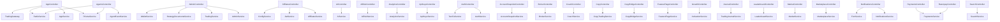

# Dependency graph (sample)

```mermaid
flowchart TB
  AppController --> AppService
  AppController --> PrismaService
  AppController --> RedisService
  AppController --> TradingGateway
  AdminController --> AdminService
  AdminController --> TradingService
  AdminController --> StrategyDocumentsService
  AdminController --> WalletService
  AffiliatesController --> AffiliatesService
  AffiliatesController --> JwtService
  AffiliatesController --> ConfigService
  AgentsController --> PrismaService
  AgentsController --> AgentEventService
  AgentsController --> RedisService
  AIController --> AIService
  AiRiskController --> AiRiskService
  AnalyticsController --> AnalyticsService
  ApiKeysController --> ApiKeysService
  AuthController --> AuthService
  AuthController --> TwoFaService
  AccountSnapshotController --> AccountSnapshotService
  BrokerController --> BrokerService
  CoachController --> CoachService
  CopyController --> CopyTradingService
  CopyBridgeController --> CopyBridgeService
  FeatureFlagsController --> FeatureFlagsService
  GrowthController --> ActivationService
  JournalController --> TradingJournalService
  LeaderboardController --> LeaderboardService
  MarketController --> MarketService
  MarketplaceController --> MarketplaceService
  NotificationsController --> NotificationsService
  NotificationsController --> FcmService
  PaymentsController --> PaymentsService
  RazorpayController --> PaymentsService
  SearchController --> SearchService
```
