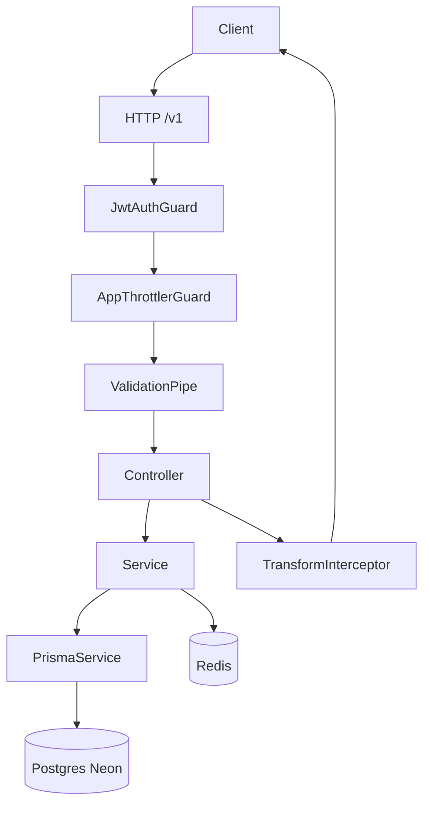
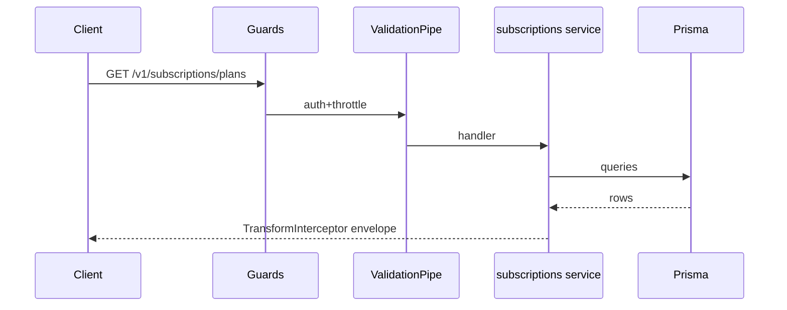
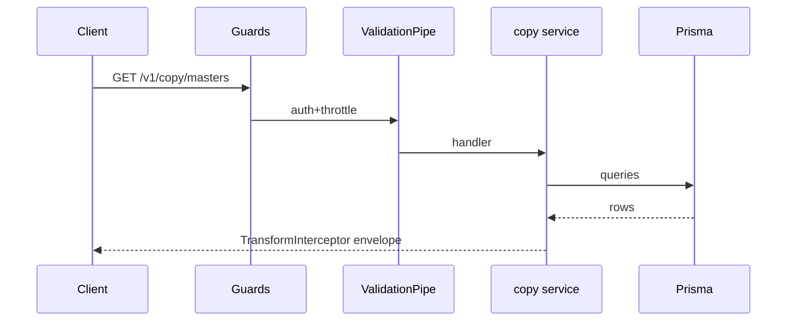
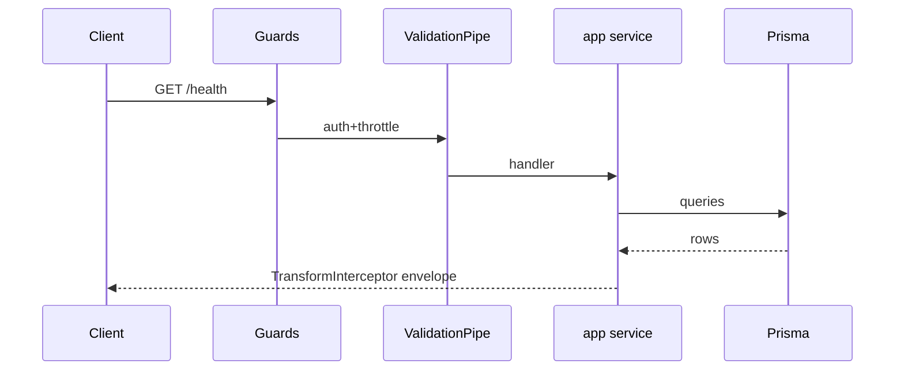
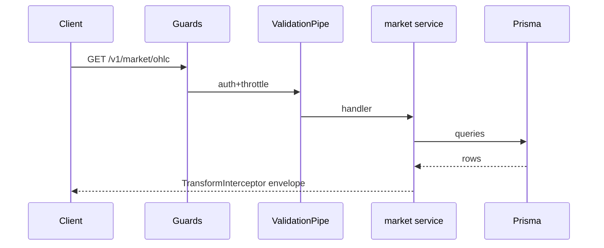
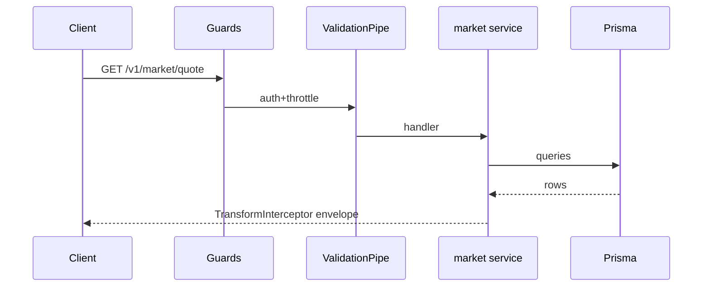
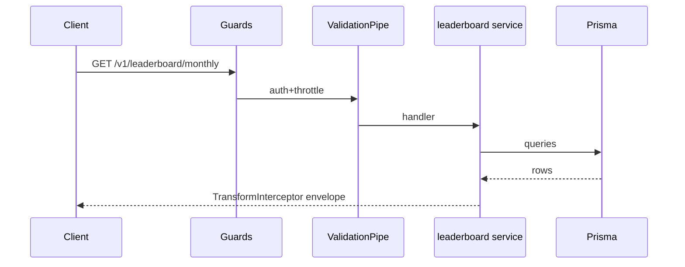
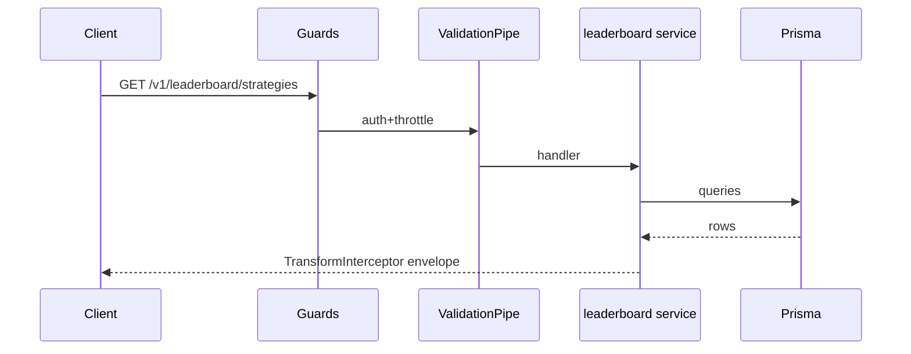
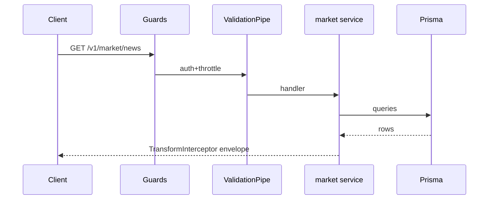

# REQUEST_FLOW_REPORT — API Audit Phase 1

## Canonical Nest pipeline

See also `diagrams/request-flow.md`.

## Hot paths (by latency p50)

### 1. `GET /v1/subscriptions/plans` (359.9 ms)

### 2. `GET /v1/copy/masters` (310.5 ms)

### 3. `GET /health` (304.1 ms)

### 4. `GET /v1/market/ohlc` (6.5 ms)

### 5. `GET /v1/market/quote` (5.5 ms)

### 6. `GET /v1/leaderboard/monthly` (4.6 ms)

### 7. `GET /v1/leaderboard/strategies` (3 ms)

### 8. `GET /v1/market/news` (3 ms)

