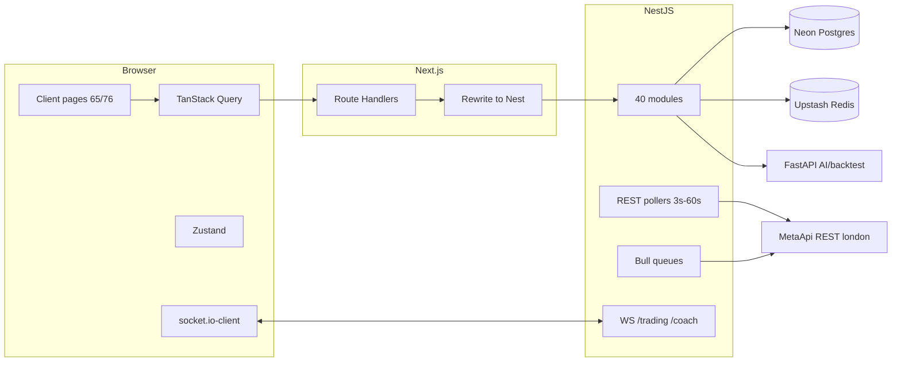

# Profytron V2 — Phase 1 Architecture, Performance & Rendering Audit

**Status:** Complete (measurement baseline)  
**Date:** 2026-07-18  
**Mode:** Read-only product code — no optimizations, refactors, UI, or business-logic changes  
**Environment:** Live local stack → Neon (us-east-1) + Upstash Redis + MetaApi (london accounts) + web:3000 + api:4000 + ai:8000 + backtest:8001  

**Index of detail:** [steps/](steps/) · [data/](data/) · [diagrams/](diagrams/) · [budgets/](budgets/)  
**Environment snapshot:** [data/environment.json](data/environment.json)

---

## 1. Executive summary

Profytron is a **client-heavy Next.js 16 + NestJS 11** trading platform. Performance today is dominated by four evidence-backed floors—not by SQL plan quality:

1. **Main-thread JavaScript on marketing/auth** — Lighthouse `/` performance **0.40**, TBT **6.8 s**, main-thread work **15.5 s**, unused JS **~1.4 MiB**. Playwright: **26 long tasks / 7.1 s** on `/`; login FCP **8.5 s** with multi-MB three.js earth assets.
2. **MetaApi REST RTT** — live `account_information` **~0.7–1.8 s**; positions **~0.6–1.5 s**. There is **no webhook/stream** path; equity is further softened by a **30 s** in-memory cache and **60 s** React Query polling — the UX “delay” is architectural.
3. **Neon round-trip latency** — `EXPLAIN ANALYZE` execution **&lt;1 ms**, but Prisma wall times **0.2–5+ s** from the audit host. Cached analytics can drop to **~10 ms**; cold paths spike to **1–2+ s**.
4. **Client rendering strategy** — **65/76** pages are `'use client'`; dashboard data is entirely browser-fetched. Server Components / streaming are unused for product data.

Accessibility on `/` scored **0.96** (LHCI target 0.95). CLS is healthy (**0.009** LH / ~0 Playwright).

Recommendations are tailored to **real-time MT5 + dashboards + AI + trading**—not copied from unrelated consumer sites.

---

## 2. Architecture diagram

Layered view: [diagrams/layered-architecture.md](diagrams/layered-architecture.md)  
Detail: [steps/01-repository.md](steps/01-repository.md)

---

## 3. Current performance metrics

| Area | Metric | Value | Source |
|------|--------|-------|--------|
| Home LH performance | score | **0.40** | `data/lighthouse/home-summary.json` |
| Home FCP | ms | 1977 (LH) / 1432 (PW) | lighthouse + playwright |
| Home LCP | ms | **50598** (LH; treat as lab anomaly + heavy hero) | lighthouse |
| Home TBT | ms | **6780** | lighthouse |
| Home main-thread | ms | **15536** | lighthouse |
| Home JS execution | ms | **13188** | lighthouse |
| Login FCP | ms | **8452** | playwright |
| Dashboard wall | ms | 8447 | playwright |
| Connected-accounts FCP | ms | 2928 | playwright |
| API `/health` | ms | **~1505** | curl (Redis probe timeout) |
| MetaApi equity | ms | 568–1780 | `metaapi-latency.json` |
| Neon SQL exec | ms | &lt;1 | `explain-analyze.json` |
| Prod build | s | ~239 | ANALYZE build |
| Static JS on disk | KB | **6857** | chunk-sizes |

---

## 4. Current Core Web Vitals

| Vital | `/` (Lighthouse) | Notes |
|-------|------------------|-------|
| LCP | 50.6 s (score 0) | Lab extreme — validate on prod `next start` + real network; still indicates heavy late content |
| INP | NOT MEASURED | Wire `NEXT_PUBLIC_VITALS_ENDPOINT` → `tools/audit/vitals-collector.mjs` in prod start |
| CLS | **0.009** (score 1) | Good |
| TBT (proxy for interactivity) | **6780 ms** | Poor |
| FCP | ~2.0 s | OK-ish; long tasks after FCP hurt |

Playwright long-task totals corroborate TBT on `/`.

---

## 5. Current bundle analysis

See [steps/02-bundle.md](steps/02-bundle.md), analyzer HTML in `data/bundle/`.

**Highlights:** 263 JS chunks, **6.7 MB** uncompressed static JS; CSS blob **379 KB**; largest chunk **486 KB**; framer-motion in **100** files; login earth assets **~3.4 MB** in `public/`; LH unused JS savings **1417 KiB**.

---

## 6. Current rendering analysis

See [steps/03-rendering.md](steps/03-rendering.md).

- Product UI is client-rendered + hydrated.
- `loading.tsx` skeletons exist; data is not RSC-streamed.
- Server Component candidates: marketing (partial), marketplace shells, settings chrome — **not** live trading widgets.

---

## 7. Dashboard performance analysis

See [steps/04-dashboard.md](steps/04-dashboard.md) + [diagrams/dashboard-dependency.md](diagrams/dashboard-dependency.md).

Cards feel slow because of **sessionReady gating + multi-query Neon RTT + MetaApi/cache tiers + 60s poll**, not because metric math is heavy. Socket invalidation (400 ms debounce) can refetch several widgets together.

---

## 8. MT5 refresh analysis

See [steps/05-mt5-metaapi.md](steps/05-mt5-metaapi.md).

Refresh UX ≈ max(React Query interval 60s, adapter equity TTL 30s, poller interval, MetaApi RTT on miss). Push/webhook path **absent**.

---

## 9. MetaApi latency analysis

| Op | Observed |
|----|----------|
| List accounts | ~896 ms |
| account_information | ~0.7–1.8 s |
| positions | ~0.6–1.5 s |
| Region | london (DEPLOYED+CONNECTED ×2) |

---

## 10. API performance analysis

See [steps/06-api.md](steps/06-api.md).

Warm Redis-backed analytics can be **&lt;10 ms**; cold **&gt;1 s**. Authenticated empty-list trading/broker calls still **200–700 ms** (Neon). **`/health` ~1.5 s** is a false reliability signal caused by a 1500 ms degraded-queue timeout.

---

## 11. Database performance analysis

See [steps/07-database.md](steps/07-database.md).

**Indexes adequate for current volume.** Bottleneck is **geography/pooling**, not planner. N+1 simulation: 6 sequential broker lookups ≈ **3 s** wall.

---

## 12. Animation performance analysis

Landing motion + Lenis correlate with catastrophic long-task totals. Login WebGL dominates FCP. Dashboard uses framer-motion widely; post-load long tasks are smaller but budget still exceeded vs [budgets/route-budgets.json](budgets/route-budgets.json).

---

## 13. Memory analysis

| Route | Heap MB (Playwright) |
|-------|----------------------|
| `/` | 157 |
| `/login` | 123 |
| `/dashboard` | 131 |
| `/connected-accounts` | **177** |

30m/1h/4h growth: **NOT MEASURED** (3-min proxy inconclusive). Suspects: Query cache, duplicate wallet socket, WebGL remounts.

---

## 14. Accessibility analysis

Lighthouse `/` accessibility **0.96**. Reduced-motion policy for framer-motion should be verified globally in Phase 2. Earth canvas must remain decorative to AT.

---

## 15. Technical debt assessment

| Debt | Severity |
|------|----------|
| Client-only dashboard architecture | High |
| MetaApi polling vs streaming | High |
| framer-motion ubiquity | High |
| Dual Next RH + Nest paths | Medium |
| Circular deps (madge ×3) | Medium |
| 1k–1.7k LOC services/pages | Medium |
| reactflow / unfinished builder | Low–Medium |
| Health endpoint timeout behavior | Medium (ops) |
| `queue: degraded` while running | Medium |

---

## 16. Security observations (performance-related only)

- Private JSON APIs correctly avoid long public cache headers.
- JWT on WebSocket handshake + Redis blacklist — reconnect storms could amplify auth Redis load.
- Throttling present; MetaApi 429 circuit breaker exists — under scale, users will see **stale** equity more often (perf/security UX overlap).
- Audit created ephemeral `demo@profytron.com` for measurement — rotate/remove if undesired in shared Neon.

---

## 17. Ranked bottlenecks (highest → lowest impact)

| Rank | Bottleneck | Evidence | Est. improvement potential |
|------|------------|----------|----------------------------|
| 1 | Main-thread JS on `/` (TBT 6.8s, 15.5s work) | LH + PW long tasks | **High** — 50–80% TBT reduction via code-split/motion trim |
| 2 | Login/WebGL asset weight (FCP 8.5s) | PW + assets inventory | **High** — FCP toward &lt;2.5s with compressed/deferred earth |
| 3 | MetaApi REST RTT + no streaming | metaapi-latency.json | **High** for “live” feel — streaming/webhooks cut perceived lag |
| 4 | Neon RTT / multi-query dashboard fan-out | Prisma wall vs EXPLAIN | **High** if API colocated or batched |
| 5 | 60s RQ poll + 30s equity cache masking freshness | useDashboardData + adapter | **Medium–High** UX clarity |
| 6 | Unused JS ~1.4 MiB | LH unused-javascript | **Medium–High** |
| 7 | CSS 379 KB single chunk | chunk-sizes | **Medium** |
| 8 | `/health` 1.5s timeout | app.controller | **Medium** (ops/K8s) |
| 9 | Socket invalidation refetch storms | useDashboardRealtime | **Medium** |
| 10 | Wallet duplicate socket | wallet/page.tsx | **Low–Medium** |
| 11 | Circular auth/client imports | madge | **Low–Medium** maintainability |
| 12 | Incomplete builder / reactflow weight | inventory | **Low** until feature ships |

---

## 18. Estimated improvement potential (per bottleneck)

| Rank | Phase 2 approach | Expected outcome |
|------|------------------|------------------|
| 1 | Route-level dynamic motion; CSS for fades; defer chatbot/analytics | TBT &lt; 500 ms on `/` |
| 2 | Lazy earth; compress HDR/JPG; static poster first paint | Login FCP &lt; 2.5 s |
| 3 | MetaApi streaming or webhook → Redis → WS | Equity updates &lt; 200 ms after broker event |
| 4 | Dashboard bootstrap BFF; region colocation | Authed API p50 &lt; 100 ms for batch |
| 5 | Tunable TTL + stale-while-revalidate UI | Perceived refresh without thundering herd |
| 6–7 | Bundle budgets in CI | Prevent regressions |
| 8 | Fail-fast health probes | Heath &lt; 100 ms |
| 9–10 | Narrow invalidate keys; shared socket only | Fewer rerenders / connections |

---

## 19. Recommended implementation roadmap (Phase 2+)

### Phase 2A — Quick wins (1–2 weeks)
1. Fix `/health` probe timeouts.  
2. Defer/lazy three.js earth; compress `public/auth/earth/*`.  
3. Trim framer-motion on landing; respect `prefers-reduced-motion`.  
4. Dashboard **bootstrap batch** endpoint.  
5. Wire CI gate proposal ([budgets/ci-performance-gate.md](budgets/ci-performance-gate.md)) as **warn**.  
6. Remove wallet ad-hoc socket.

### Phase 2B — Architecture (2–6 weeks)
1. MetaApi streaming or account webhook → Redis → `/trading` socket → selective RQ setQueryData.  
2. Introduce Server Components for non-live shells; keep live widgets client.  
3. Colocate API with Neon region; evaluate read path caching.  
4. React Profiler lab → real Top-50 list; fix hottest commit paths.  
5. Production `next start` CWV baselines (replace dev-server numbers).

### Phase 2C — Scale & polish
1. k6 100→10k VU curves; MetaApi quota budgeting.  
2. 30m/1h/4h memory lab.  
3. GPU/FPS lab for premium motion.  
4. Edge/partial hydration evaluation per Step 34 scorecard.  
5. Promote CI gate warn → fail.

---

## Deep-audit coverage checklist (Steps 17–34)

| Step | Delivered | Gaps marked NOT MEASURED |
|------|-----------|--------------------------|
| 17 Main thread | Yes (LH + PW + CDP summaries) | Full interactive flame PNG |
| 18 Fiber Top-50 | Structural proxy | Profiler CSV |
| 19 Scheduler | Code + inference | Transition traces |
| 20 Pipeline | Inferred from long tasks | Paint profiler screenshots |
| 21 GPU | Asset + FCP signals | GPU memory counters |
| 22 Event loop | Browser long tasks; health timeout | Node ELD histogram |
| 23 Dependency graph | Yes | — |
| 24 Cache lifecycle | Yes | — |
| 25 MT5 timeline | Yes (measured) | — |
| 26 Budgets | Yes | — |
| 27 Memory growth | 3-min proxy only | 30m/1h/4h |
| 28 WebSocket | Code + architecture | Packet loss lab |
| 29 Animation graph | Yes | — |
| 30 CI gate | Design only | Not wired |
| 31 Scalability | Scripts exist | k6 not installed |
| 32 Ownership | Path map | Org confirm |
| 33 Layered diagram | Yes | — |
| 34 Future readiness | Scorecard | — |

---

## Validation

- Product application source **not optimized** in this phase.  
- Profiling-only additions: `@next/bundle-analyzer`, `source-map-explorer`, `tools/audit/*`, `docs/audit/**`.  
- All numeric claims cite files under `docs/audit/data/` or linked step docs.

**Phase 1 complete — do not begin optimization until this report is reviewed and accepted.**
