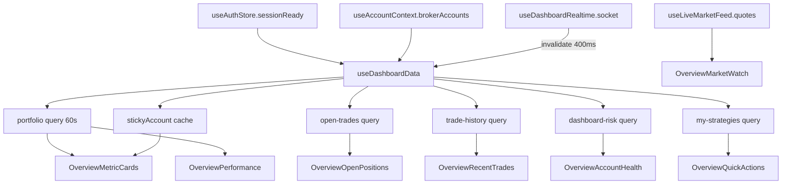

# Dashboard dependency graph

## Invalidation blast radius

Trade socket events → `invalidateAccountQueries` → typically portfolio + open trades + related account keys → MetricCards + tables + chart potentially all rerender together.
