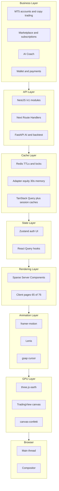

# Layered rendering architecture (Profytron-mapped)

```mermaid
flowchart TB
  subgraph business [Business Layer]
    mt5[MT5 accounts and copy trading]
    mkt[Marketplace and subscriptions]
    coach[AI Coach]
    wallet[Wallet and payments]
  end

  subgraph apiLayer [API Layer]
    nest[NestJS /v1 modules]
    rh[Next Route Handlers]
    py[FastAPI AI and backtest]
  end

  subgraph cacheLayer [Cache Layer]
    redis[Redis TTLs and locks]
    mem[Adapter equity 30s memory]
    rqCache[TanStack Query plus session caches]
  end

  subgraph stateLayer [State Layer]
    zustand[Zustand auth UI]
    rq[React Query hooks]
  end

  subgraph renderLayer [Rendering Layer]
    rsc[Sparse Server Components]
    client[Client pages 65 of 76]
  end

  subgraph animLayer [Animation Layer]
    fm[framer-motion]
    lenis[Lenis]
    gsap[gsap cursor]
  end

  subgraph gpuLayer [GPU Layer]
    three[three.js earth]
    tv[TradingView canvas]
    confetti[canvas-confetti]
  end

  subgraph browser [Browser]
    main[Main thread]
    compositor[Compositor]
  end

  business --> apiLayer --> cacheLayer --> stateLayer --> renderLayer --> animLayer --> gpuLayer --> browser
```
