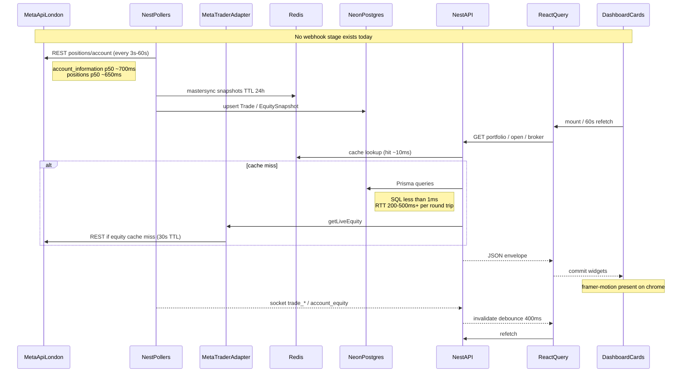

# MT5 / MetaApi synchronization sequence (measured)

## Arrow latency table

| Arrow | Measured |
|-------|----------|
| MetaApi account_information | 568–1780 ms |
| MetaApi positions | 628–1453 ms |
| MetaApi list accounts | ~896 ms |
| Adapter equity memory hit | ≪ MetaApi (30s TTL) |
| Prisma SQL execution | <1 ms (EXPLAIN) |
| Prisma wall via network | 0.2–5 s depending on round-trips |
| Redis analytics hit | ~3–10 ms API total |
| API portfolio cold | up to 1351 ms |
| React Query poll interval | 60_000 ms |
| Socket invalidate debounce | 400 ms |
| Health Redis timeout floor | 1500 ms |
