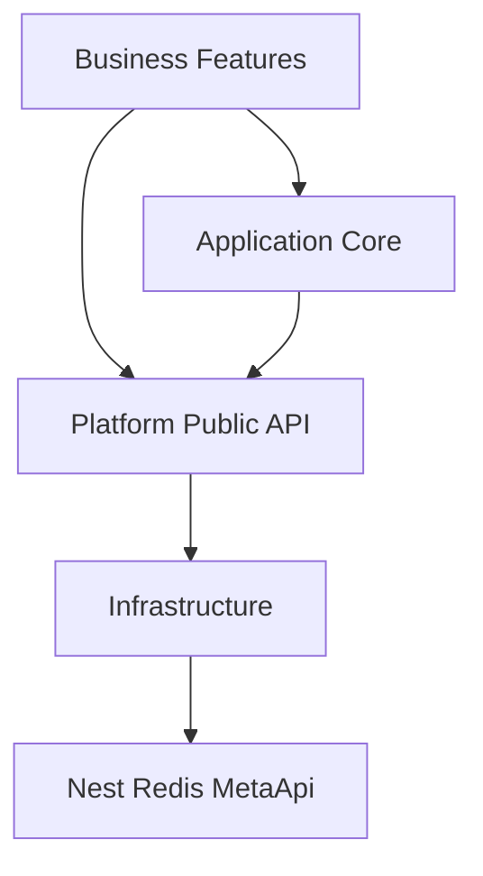
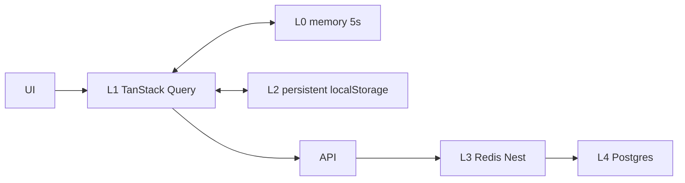
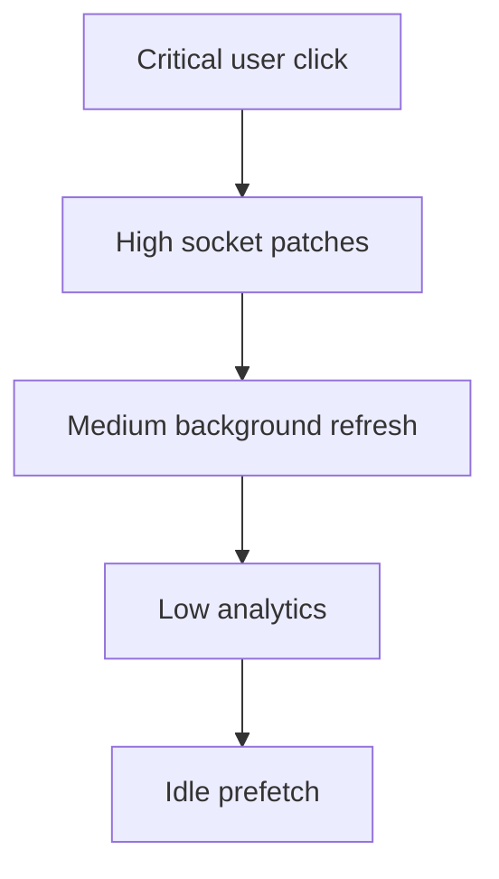
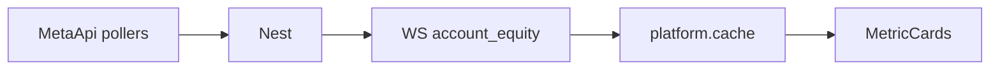

# Phase 2 Architecture Diagrams

## Layering

```mermaid
flowchart TB
  features[Business Features]
  core[Application Core]
  platform[Platform Public API]
  infra[Infrastructure]
  backend[Nest Redis MetaApi]

  features --> core
  features --> platform
  core --> platform
  platform --> infra
  infra --> backend
```

## Cache

```mermaid
flowchart LR
  L0[L0 memory 5s]
  L1[L1 TanStack Query]
  L2[L2 persistent localStorage]
  L3[L3 Redis Nest]
  L4[L4 Postgres]
  UI --> L1
  L1 <--> L0
  L1 <--> L2
  L1 --> API --> L3 --> L4
```

## Request priorities

```mermaid
flowchart TB
  critical[Critical user click]
  high[High socket patches]
  medium[Medium background refresh]
  low[Low analytics]
  idle[Idle prefetch]
  critical --> high --> medium --> low --> idle
```

## MT5 state path

```mermaid
flowchart LR
  ma[MetaApi pollers]
  nest[Nest]
  ws[WS account_equity]
  cache[platform.cache]
  ui[MetricCards]
  ma --> nest --> ws --> cache --> ui
```
