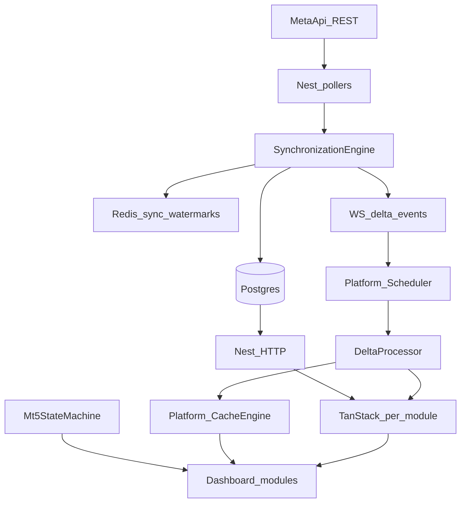

# Phase 3 target architecture

```mermaid
flowchart TD
  MetaApi[MetaApi_REST]
  Pollers[Nest_pollers]
  SyncEngine[SynchronizationEngine]
  RedisState[Redis_sync_watermarks]
  PG[(Postgres)]
  API[Nest_HTTP]
  WS[WS_delta_events]
  Sched[Platform_Scheduler]
  Delta[DeltaProcessor]
  Cache[Platform_CacheEngine]
  RQ[TanStack_per_module]
  FSM[Mt5StateMachine]
  UI[Dashboard_modules]

  MetaApi --> Pollers --> SyncEngine
  SyncEngine --> RedisState
  SyncEngine --> PG
  SyncEngine --> WS
  PG --> API --> RQ
  WS --> Sched --> Delta --> Cache
  Delta --> RQ
  FSM --> UI
  Cache --> UI
  RQ --> UI
```

See also: [sync-timing.md](./sync-timing.md), [delta-scheduler.md](./delta-scheduler.md).
