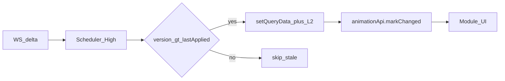
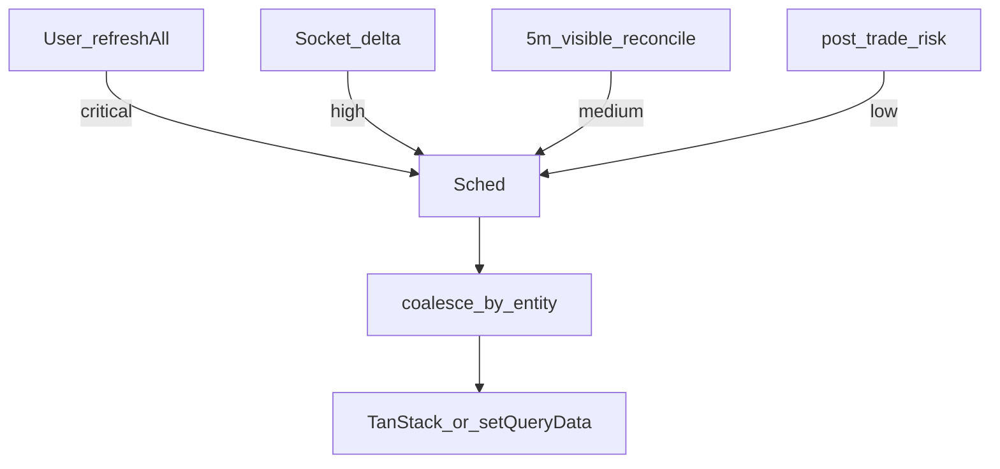

# Phase 3 — Cache & delta synchronization

```mermaid
flowchart LR
  WS[WS_delta]
  Sched[Scheduler_High]
  Ver{version_gt_lastApplied}
  Patch[setQueryData_plus_L2]
  Anim[animationApi.markChanged]
  UI[Module_UI]

  WS --> Sched --> Ver
  Ver -->|yes| Patch --> Anim --> UI
  Ver -->|no| Drop[skip_stale]
```

# Scheduler flow

```mermaid
flowchart TD
  User[User_refreshAll] -->|critical| Sched
  Socket[Socket_delta] -->|high| Sched
  Bg[5m_visible_reconcile] -->|medium| Sched
  Risk[post_trade_risk] -->|low| Sched
  Sched --> Coalesce[coalesce_by_entity]
  Coalesce --> RQ[TanStack_or_setQueryData]
```
