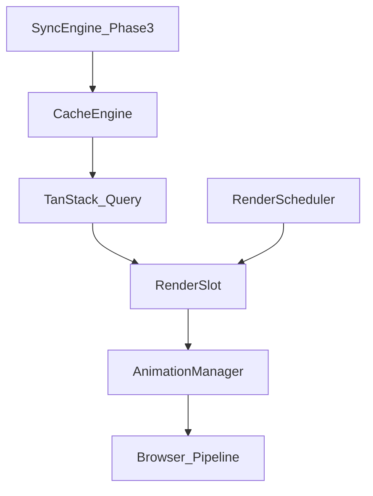

# Phase 4 architecture

```mermaid
flowchart TD
  Sync[SyncEngine_Phase3]
  Cache[CacheEngine]
  RQ[TanStack_Query]
  RS[RenderScheduler]
  Slot[RenderSlot]
  Anim[AnimationManager]
  Browser[Browser_Pipeline]

  Sync --> Cache --> RQ
  RQ --> Slot
  RS --> Slot
  Slot --> Anim --> Browser
```

See also: [render-timing.md](./render-timing.md), [render-graph.md](./render-graph.md).
