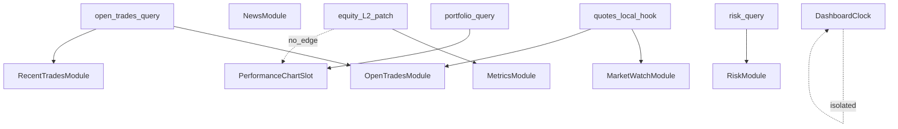

# Dashboard render graph

```mermaid
flowchart TD
  Equity[equity_L2_patch]
  Metrics[MetricsModule]
  Positions[OpenTradesModule]
  PnL[RecentTradesModule]
  Chart[PerformanceChartSlot]
  Watch[MarketWatchModule]
  Risk[RiskModule]
  News[NewsModule]
  Clock[DashboardClock]

  Equity --> Metrics
  Equity -.->|no_edge| Chart
  QuotesLocal[quotes_local_hook] --> Watch
  QuotesLocal --> Positions
  OpenTradesQ[open_trades_query] --> Positions
  OpenTradesQ --> PnL
  PortfolioQ[portfolio_query] --> Chart
  RiskQ[risk_query] --> Risk
  Clock -.->|isolated| Clock
```

Declared in code: `apps/web/src/platform/rendering/render-graph.ts`
