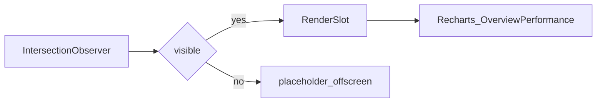

# Viewport + chart rendering

- PerformanceChartSlot: viewport-gated, dynamic import, React.memo
- News/Calendar: ViewportModule below-fold pause
- Document hidden: animationApi.pauseAll via DashboardLayoutClient
