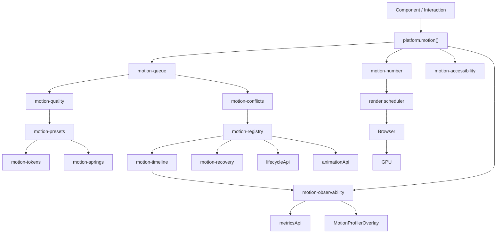

# Phase 5 — Motion Architecture

## Pipeline

1. Feature requests motion via `platform.motion()` presets / number API.
2. Job enters **queue** lane (Critical → Idle).
3. **Quality Manager** scales duration / disables decorative / springs.
4. **Conflict resolver** claims `(element, property)`.
5. **Registry** owns lifecycle + pause/resume via lifecycle + animation APIs.
6. **Timeline** records Created → … → Disposed.
7. **Recovery** finishes or cancels so UI never stays mid-tween.
