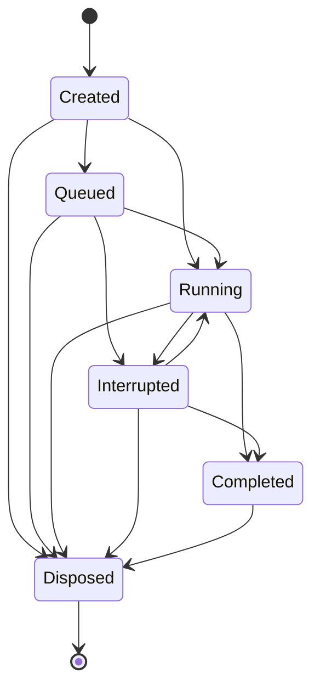

# Motion Lifecycle

Recovery on interrupt / tab-hidden / dispose:

- Critical / Interaction / Feedback → **Finish** (snap to final)
- Decorative / Idle → **Cancel** (settle current or drop)
- Explicit resume when tab visible again
