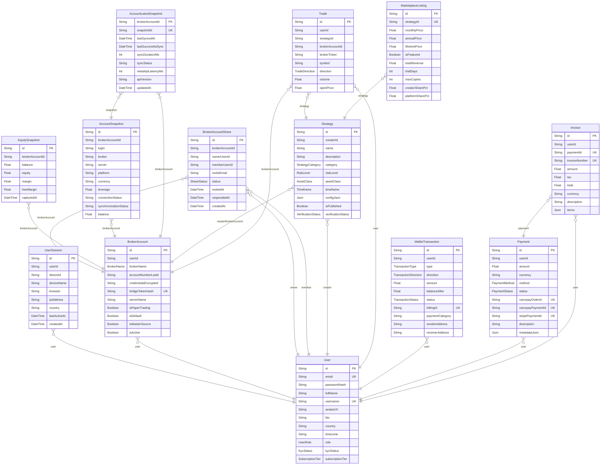

# ER_DIAGRAM — Phase 1

Generated from Prisma relation attributes (measure-only). Live FK list appended when connected.

## Core domain (subset)

## Relationship inventory summary

| Metric | Count |
|--------|------:|
| Relation fields (Prisma) | 113 |
| Live FK constraints | 96 |
| Cascades declared (onDelete/onUpdate) | 78 |

### Cascades (Prisma)

| From | Field | To | onDelete | onUpdate |
|------|-------|----|----------|----------|
| UserActivationEvent | user | User | Cascade | — |
| UserSession | user | User | Cascade | — |
| BrokerAccount | user | User | Cascade | — |
| BrokerAccountShare | brokerAccount | BrokerAccount | Cascade | — |
| BrokerAccountShare | owner | User | Cascade | — |
| BrokerAccountShare | member | User | Cascade | — |
| EquitySnapshot | brokerAccount | BrokerAccount | Cascade | — |
| AccountSnapshot | brokerAccount | BrokerAccount | Cascade | — |
| AccountLatestSnapshot | brokerAccount | BrokerAccount | Cascade | — |
| AccountLatestSnapshot | snapshot | AccountSnapshot | Cascade | — |
| AccountSnapshotPosition | snapshot | AccountSnapshot | Cascade | — |
| AccountSnapshotPendingOrder | snapshot | AccountSnapshot | Cascade | — |
| AccountSnapshotDeal | snapshot | AccountSnapshot | Cascade | — |
| AccountSnapshotOrderHistory | snapshot | AccountSnapshot | Cascade | — |
| AccountSnapshotSymbol | snapshot | AccountSnapshot | Cascade | — |
| AccountSnapshotMarketData | snapshot | AccountSnapshot | Cascade | — |
| AccountSnapshotStatus | snapshot | AccountSnapshot | Cascade | — |
| AccountSnapshotCopyTrading | snapshot | AccountSnapshot | Cascade | — |
| AccountSnapshotPerformance | snapshot | AccountSnapshot | Cascade | — |
| AccountSnapshotRisk | snapshot | AccountSnapshot | Cascade | — |
| AccountSnapshotEvent | snapshot | AccountSnapshot | Cascade | — |
| Strategy | masterBrokerAccount | BrokerAccount | SetNull | — |
| StrategyPerformance | strategy | Strategy | Cascade | — |
| UserStrategySubscription | user | User | Cascade | — |
| UserStrategySubscription | strategy | Strategy | Cascade | — |
| UserStrategySubscription | brokerAccount | BrokerAccount | Cascade | — |
| ProfitShareLedgerEntry | subscription | UserStrategySubscription | Cascade | — |
| ProfitShareLedgerEntry | walletTransaction | WalletTransaction | SetNull | — |
| AffiliateFunnelEvent | referrer | User | Cascade | — |
| AffiliateFunnelEvent | referee | User | SetNull | — |
| UserAchievement | user | User | Cascade | — |
| Notification | user | User | Cascade | — |
| NotificationPreference | user | User | Cascade | — |
| UserFcmToken | user | User | Cascade | — |
| LeaderboardEntry | user | User | Cascade | — |
| Payment | user | User | Cascade | — |
| Invoice | user | User | Cascade | — |
| Invoice | payment | Payment | Cascade | — |
| UserSubscription | user | User | Cascade | — |
| TraderProfile | user | User | Cascade | — |
| SocialComment | trade | Trade | Cascade | — |
| SocialComment | user | User | Cascade | — |
| SocialComment | profile | TraderProfile | Cascade | — |
| SocialComment | replyTo | SocialComment | Cascade | — |
| SocialFollow | follower | TraderProfile | Cascade | — |
| SocialFollow | following | TraderProfile | Cascade | — |
| SupportTicket | user | User | Cascade | — |
| SupportTicket | walletTxn | WalletTransaction | SetNull | Cascade |
| SupportTicketResponse | ticket | SupportTicket | Cascade | — |
| StrategyBuilder | user | User | Cascade | — |
| StrategyNode | builder | StrategyBuilder | Cascade | — |
| StrategyEdge | builder | StrategyBuilder | Cascade | — |
| StrategyEdge | fromNode | StrategyNode | Cascade | — |
| StrategyEdge | toNode | StrategyNode | Cascade | — |
| VpsAccount | user | User | Cascade | — |
| BotInstance | vps | VpsAccount | Cascade | — |
| AiRiskPolicy | user | User | Cascade | — |
| UserPreference | user | User | Cascade | — |
| TutorialProgress | user | User | Cascade | — |
| BrokerApiCredential | user | User | Cascade | — |
| TradeJournalEntry | user | User | Cascade | — |
| ApiKey | user | User | Cascade | — |
| MasterProfile | user | User | Cascade | — |
| MasterProfile | brokerAccount | BrokerAccount | SetNull | — |
| CopyRelationship | masterProfile | MasterProfile | Cascade | — |
| CopyRelationship | follower | User | Cascade | — |
| TradeExecution | copyRelationship | CopyRelationship | SetNull | — |
| CopyBridgeOrder | brokerAccount | BrokerAccount | Cascade | — |
| StrategyDocument | strategy | Strategy | Cascade | — |
| ProvisioningJob | subscription | UserStrategySubscription | Cascade | — |
| CoachConversation | user | User | Cascade | — |
| CoachMessage | conversation | CoachConversation | Cascade | — |
| CoachMessage | faqAnswer | CoachFaqAnswer | SetNull | — |
| CoachMessage | sender | User | SetNull | — |
| CoachFaqQuestion | answer | CoachFaqAnswer | Cascade | — |
| CoachEscalation | conversation | CoachConversation | Cascade | — |
| CoachEscalation | user | User | Cascade | — |
| CoachEscalation | claimedBy | User | SetNull | — |

### Live foreign keys (sample / all)

| From | Column | To | Column | ON DELETE | ON UPDATE |
|------|--------|----|--------|-----------|-----------|
| AITradeExplanation | strategyId | Strategy | id | SET NULL | CASCADE |
| AITradeExplanation | tradeId | Trade | id | RESTRICT | CASCADE |
| AccountLatestSnapshot | brokerAccountId | BrokerAccount | id | CASCADE | CASCADE |
| AccountLatestSnapshot | snapshotId | AccountSnapshot | id | CASCADE | CASCADE |
| AccountSnapshot | brokerAccountId | BrokerAccount | id | CASCADE | CASCADE |
| AccountSnapshotCopyTrading | snapshotId | AccountSnapshot | id | CASCADE | CASCADE |
| AccountSnapshotDeal | snapshotId | AccountSnapshot | id | CASCADE | CASCADE |
| AccountSnapshotEvent | snapshotId | AccountSnapshot | id | CASCADE | CASCADE |
| AccountSnapshotMarketData | snapshotId | AccountSnapshot | id | CASCADE | CASCADE |
| AccountSnapshotOrderHistory | snapshotId | AccountSnapshot | id | CASCADE | CASCADE |
| AccountSnapshotPendingOrder | snapshotId | AccountSnapshot | id | CASCADE | CASCADE |
| AccountSnapshotPerformance | snapshotId | AccountSnapshot | id | CASCADE | CASCADE |
| AccountSnapshotPosition | snapshotId | AccountSnapshot | id | CASCADE | CASCADE |
| AccountSnapshotRisk | snapshotId | AccountSnapshot | id | CASCADE | CASCADE |
| AccountSnapshotStatus | snapshotId | AccountSnapshot | id | CASCADE | CASCADE |
| AccountSnapshotSymbol | snapshotId | AccountSnapshot | id | CASCADE | CASCADE |
| Affiliate | referrerId | User | id | SET NULL | CASCADE |
| Affiliate | userId | User | id | RESTRICT | CASCADE |
| AffiliateFunnelEvent | referrerId | User | id | CASCADE | CASCADE |
| AffiliateFunnelEvent | refereeId | User | id | SET NULL | CASCADE |
| AiRiskPolicy | userId | User | id | CASCADE | CASCADE |
| ApiKey | userId | User | id | CASCADE | CASCADE |
| AuditLog | userId | User | id | SET NULL | CASCADE |
| BotInstance | vpsId | VpsAccount | id | CASCADE | CASCADE |
| BrokerAccount | userId | User | id | CASCADE | CASCADE |
| BrokerAccountShare | ownerUserId | User | id | CASCADE | CASCADE |
| BrokerAccountShare | brokerAccountId | BrokerAccount | id | CASCADE | CASCADE |
| BrokerAccountShare | memberUserId | User | id | CASCADE | CASCADE |
| BrokerApiCredential | userId | User | id | CASCADE | CASCADE |
| CoachConversation | userId | User | id | CASCADE | CASCADE |
| CoachEscalation | conversationId | CoachConversation | id | CASCADE | CASCADE |
| CoachEscalation | userId | User | id | CASCADE | CASCADE |
| CoachEscalation | claimedById | User | id | SET NULL | CASCADE |
| CoachFaqQuestion | answerId | CoachFaqAnswer | id | CASCADE | CASCADE |
| CoachMessage | faqAnswerId | CoachFaqAnswer | id | SET NULL | CASCADE |
| CoachMessage | conversationId | CoachConversation | id | CASCADE | CASCADE |
| CoachMessage | senderId | User | id | SET NULL | CASCADE |
| CopyBridgeOrder | brokerAccountId | BrokerAccount | id | CASCADE | CASCADE |
| CopyRelationship | masterProfileId | MasterProfile | id | CASCADE | CASCADE |
| CopyRelationship | followerUserId | User | id | CASCADE | CASCADE |
| EquitySnapshot | brokerAccountId | BrokerAccount | id | CASCADE | CASCADE |
| Invoice | userId | User | id | CASCADE | CASCADE |
| Invoice | paymentId | Payment | id | CASCADE | CASCADE |
| KycDocument | userId | User | id | RESTRICT | CASCADE |
| LeaderboardEntry | userId | User | id | CASCADE | CASCADE |
| MarketplaceListing | strategyId | Strategy | id | RESTRICT | CASCADE |
| MasterProfile | brokerAccountId | BrokerAccount | id | SET NULL | CASCADE |
| MasterProfile | userId | User | id | CASCADE | CASCADE |
| Notification | userId | User | id | CASCADE | CASCADE |
| NotificationPreference | userId | User | id | CASCADE | CASCADE |
| Payment | userId | User | id | CASCADE | CASCADE |
| ProfitShareLedgerEntry | subscriptionId | UserStrategySubscription | id | CASCADE | CASCADE |
| ProfitShareLedgerEntry | walletTransactionId | WalletTransaction | id | SET NULL | CASCADE |
| ProvisioningJob | subscriptionId | UserStrategySubscription | id | CASCADE | CASCADE |
| SocialComment | profileId | TraderProfile | id | CASCADE | CASCADE |
| SocialComment | tradeId | Trade | id | CASCADE | CASCADE |
| SocialComment | userId | User | id | CASCADE | CASCADE |
| SocialComment | replyToId | SocialComment | id | CASCADE | CASCADE |
| SocialFollow | followingId | TraderProfile | userId | CASCADE | CASCADE |
| SocialFollow | followerId | TraderProfile | userId | CASCADE | CASCADE |
| Strategy | masterBrokerAccountId | BrokerAccount | id | SET NULL | CASCADE |
| Strategy | creatorId | User | id | RESTRICT | CASCADE |
| StrategyBuilder | userId | User | id | CASCADE | CASCADE |
| StrategyDocument | strategyId | Strategy | id | CASCADE | CASCADE |
| StrategyEdge | toNodeId | StrategyNode | id | CASCADE | CASCADE |
| StrategyEdge | builderId | StrategyBuilder | id | CASCADE | CASCADE |
| StrategyEdge | fromNodeId | StrategyNode | id | CASCADE | CASCADE |
| StrategyNode | builderId | StrategyBuilder | id | CASCADE | CASCADE |
| StrategyPerformance | strategyId | Strategy | id | CASCADE | CASCADE |
| StrategyReview | strategyId | Strategy | id | RESTRICT | CASCADE |
| StrategyReview | userId | User | id | RESTRICT | CASCADE |
| SupportTicket | userId | User | id | CASCADE | CASCADE |
| SupportTicket | billingId | WalletTransaction | billingId | SET NULL | CASCADE |
| SupportTicketResponse | userId | User | id | RESTRICT | CASCADE |
| SupportTicketResponse | ticketId | SupportTicket | id | CASCADE | CASCADE |
| Trade | brokerAccountId | BrokerAccount | id | SET NULL | CASCADE |
| Trade | userId | User | id | RESTRICT | CASCADE |
| Trade | strategyId | Strategy | id | SET NULL | CASCADE |
| TradeExecution | copyRelationshipId | CopyRelationship | id | SET NULL | CASCADE |
| TradeJournalEntry | userId | User | id | CASCADE | CASCADE |
| TradeJournalEntry | tradeId | Trade | id | SET NULL | CASCADE |
| TraderProfile | userId | User | id | CASCADE | CASCADE |
| TutorialProgress | userId | User | id | CASCADE | CASCADE |
| UserAchievement | userId | User | id | CASCADE | CASCADE |
| UserActivationEvent | userId | User | id | CASCADE | CASCADE |
| UserFcmToken | userId | User | id | CASCADE | CASCADE |
| UserPreference | userId | User | id | CASCADE | CASCADE |
| UserSession | userId | User | id | CASCADE | CASCADE |
| UserStrategySubscription | strategyId | Strategy | id | CASCADE | CASCADE |
| UserStrategySubscription | userId | User | id | CASCADE | CASCADE |
| UserStrategySubscription | brokerAccountId | BrokerAccount | id | CASCADE | CASCADE |
| UserSubscription | paymentId | Payment | id | SET NULL | CASCADE |
| UserSubscription | planId | SubscriptionPlan | id | RESTRICT | CASCADE |
| UserSubscription | userId | User | id | CASCADE | CASCADE |
| VpsAccount | userId | User | id | CASCADE | CASCADE |
| WalletTransaction | userId | User | id | RESTRICT | CASCADE |

## Full model list (80)

- **User** — 69 fields, PK `[id]`, 2 @@index
- **UserActivationEvent** — 6 fields, PK `[id]`, 3 @@index
- **UserSession** — 10 fields, PK `[id]`, 2 @@index
- **BrokerAccount** — 27 fields, PK `[id]`, 2 @@index
- **BrokerAccountShare** — 13 fields, PK `[id]`, 3 @@index
- **EquitySnapshot** — 8 fields, PK `[id]`, 1 @@index
- **AccountSnapshot** — 56 fields, PK `[id]`, 1 @@index
- **AccountLatestSnapshot** — 11 fields, PK `[brokerAccountId]`, 2 @@index
- **AccountSnapshotPosition** — 26 fields, PK `[id]`, 4 @@index
- **AccountSnapshotPendingOrder** — 17 fields, PK `[id]`, 4 @@index
- **AccountSnapshotDeal** — 18 fields, PK `[id]`, 4 @@index
- **AccountSnapshotOrderHistory** — 19 fields, PK `[id]`, 3 @@index
- **AccountSnapshotSymbol** — 18 fields, PK `[id]`, 2 @@index
- **AccountSnapshotMarketData** — 17 fields, PK `[id]`, 2 @@index
- **AccountSnapshotStatus** — 13 fields, PK `[id]`, 2 @@index
- **AccountSnapshotCopyTrading** — 14 fields, PK `[id]`, 2 @@index
- **AccountSnapshotPerformance** — 48 fields, PK `[id]`, 1 @@index
- **AccountSnapshotRisk** — 19 fields, PK `[id]`, 1 @@index
- **AccountSnapshotEvent** — 10 fields, PK `[id]`, 3 @@index
- **Strategy** — 37 fields, PK `[id]`, 3 @@index
- **StrategyPerformance** — 14 fields, PK `[id]`, 1 @@index
- **UserStrategySubscription** — 35 fields, PK `[id]`, 5 @@index
- **Trade** — 33 fields, PK `[id]`, 10 @@index
- **WalletTransaction** — 23 fields, PK `[id]`, 5 @@index
- **ProfitShareLedgerEntry** — 14 fields, PK `[id]`, 3 @@index
- **MarketplaceListing** — 16 fields, PK `[id]`, 2 @@index
- **Affiliate** — 14 fields, PK `[id]`, 1 @@index
- **AffiliateFunnelEvent** — 9 fields, PK `[id]`, 2 @@index
- **UserAchievement** — 7 fields, PK `[id]`, 1 @@index
- **Notification** — 14 fields, PK `[id]`, 3 @@index
- **NotificationPreference** — 17 fields, PK `[id]`, 0 @@index
- **NotificationLog** — 7 fields, PK `[id]`, 3 @@index
- **StrategyReview** — 11 fields, PK `[id]`, 2 @@index
- **AITradeExplanation** — 10 fields, PK `[id]`, 1 @@index
- **KycDocument** — 10 fields, PK `[id]`, 1 @@index
- **UserFcmToken** — 7 fields, PK `[id]`, 1 @@index
- **LeaderboardEntry** — 12 fields, PK `[id]`, 1 @@index
- **AuditLog** — 9 fields, PK `[id]`, 2 @@index
- **Payment** — 17 fields, PK `[id]`, 2 @@index
- **Invoice** — 16 fields, PK `[id]`, 2 @@index
- **SubscriptionPlan** — 12 fields, PK `[id]`, 1 @@index
- **UserSubscription** — 15 fields, PK `[id]`, 1 @@index
- **TraderProfile** — 21 fields, PK `[id]`, 2 @@index
- **SocialComment** — 14 fields, PK `[id]`, 4 @@index
- **SocialFollow** — 6 fields, PK `[id]`, 2 @@index
- **SupportTicket** — 15 fields, PK `[id]`, 3 @@index
- **SupportTicketResponse** — 8 fields, PK `[id]`, 2 @@index
- **StrategyBuilder** — 10 fields, PK `[id]`, 1 @@index
- **StrategyNode** — 10 fields, PK `[id]`, 1 @@index
- **StrategyEdge** — 7 fields, PK `[id]`, 3 @@index
- **VpsAccount** — 18 fields, PK `[id]`, 2 @@index
- **BotInstance** — 13 fields, PK `[id]`, 1 @@index
- **AiRiskPolicy** — 14 fields, PK `[id]`, 1 @@index
- **UserPreference** — 10 fields, PK `[id]`, 1 @@index
- **TutorialProgress** — 9 fields, PK `[id]`, 1 @@index
- **BrokerApiCredential** — 11 fields, PK `[id]`, 1 @@index
- **TradeJournalEntry** — 12 fields, PK `[id]`, 1 @@index
- **WebhookEvent** — 8 fields, PK `[id]`, 2 @@index
- **FeatureFlag** — 9 fields, PK `[id]`, 2 @@index
- **ApiKey** — 11 fields, PK `[id]`, 2 @@index
- **AgentEventOutbox** — 9 fields, PK `[id]`, 2 @@index
- **AgentJob** — 16 fields, PK `[id]`, 2 @@index
- **AgentInsight** — 8 fields, PK `[id]`, 1 @@index
- **DailyMetricsSnapshot** — 10 fields, PK `[date]`, 0 @@index
- **SupportKnowledgeChunk** — 6 fields, PK `[id]`, 0 @@index
- **AgentBudget** — 7 fields, PK `[agentType]`, 0 @@index
- **MasterProfile** — 18 fields, PK `[id]`, 2 @@index
- **CopyRelationship** — 16 fields, PK `[id]`, 2 @@index
- **TradeEvent** — 15 fields, PK `[id]`, 3 @@index
- **TradeExecution** — 20 fields, PK `[id]`, 3 @@index
- **CopyBridgeOrder** — 21 fields, PK `[id]`, 5 @@index
- **StrategyDocument** — 14 fields, PK `[id]`, 2 @@index
- **ProvisioningJob** — 10 fields, PK `[id]`, 1 @@index
- **PaymentIdempotency** — 6 fields, PK `[idempotencyKey]`, 1 @@index
- **EmailLog** — 8 fields, PK `[id]`, 3 @@index
- **CoachConversation** — 9 fields, PK `[id]`, 2 @@index
- **CoachMessage** — 11 fields, PK `[id]`, 2 @@index
- **CoachFaqAnswer** — 7 fields, PK `[id]`, 1 @@index
- **CoachFaqQuestion** — 7 fields, PK `[id]`, 2 @@index
- **CoachEscalation** — 14 fields, PK `[id]`, 4 @@index

## Cardinality notes

- **One-to-many / many-to-one:** Dominant pattern (`User` → accounts, trades, sessions).
- **One-to-one:** Present where Prisma uses unique FK or opposing optional scalar (see inventory JSON).
- **Many-to-many:** Explicit join models where used (no implicit `_AToB` join tables detected in inventory beyond explicit models — verify `schema-inventory.json`).
- **Circular risk:** Watch strategy ↔ broker / copy relations with dual FKs; no schema mutation in Phase 1.

## Circular / self relations

- SocialComment.replyTo → SocialComment
- SocialComment.replies → SocialComment
