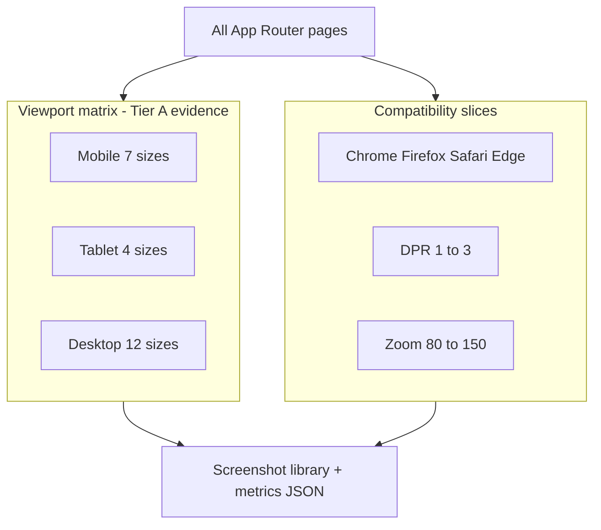

# Display Matrix

```mermaid
flowchart TB
  subgraph viewport [Viewport matrix - Tier A evidence]
    mobile[Mobile 7 sizes]
    tablet[Tablet 4 sizes]
    desktop[Desktop 12 sizes]
  end
  subgraph slices [Compatibility slices]
    browsers[Chrome Firefox Safari Edge]
    dpi[DPR 1 to 3]
    zoom[Zoom 80 to 150]
  end
  pages[All App Router pages]
  pages --> viewport
  pages --> slices
  viewport --> evidence[Screenshot library + metrics JSON]
  slices --> evidence
```

See `tools/ui-audit/routes.json` for exact sizes.
