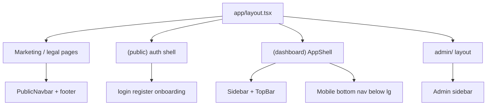

# Layout Shells

| Shell | Routes | Chrome |
| --- | --- | --- |
| marketing | `/`, `/pricing`, `/about`, legal, docs, blog | Public navbar/footer |
| auth | `/login`, `/register`, onboarding, password flows | Minimal providers |
| dashboard | Authenticated app including marketplace | AppShell; sidebar collapses `< lg` |
| admin | `/admin/*` | Separate admin shell |
