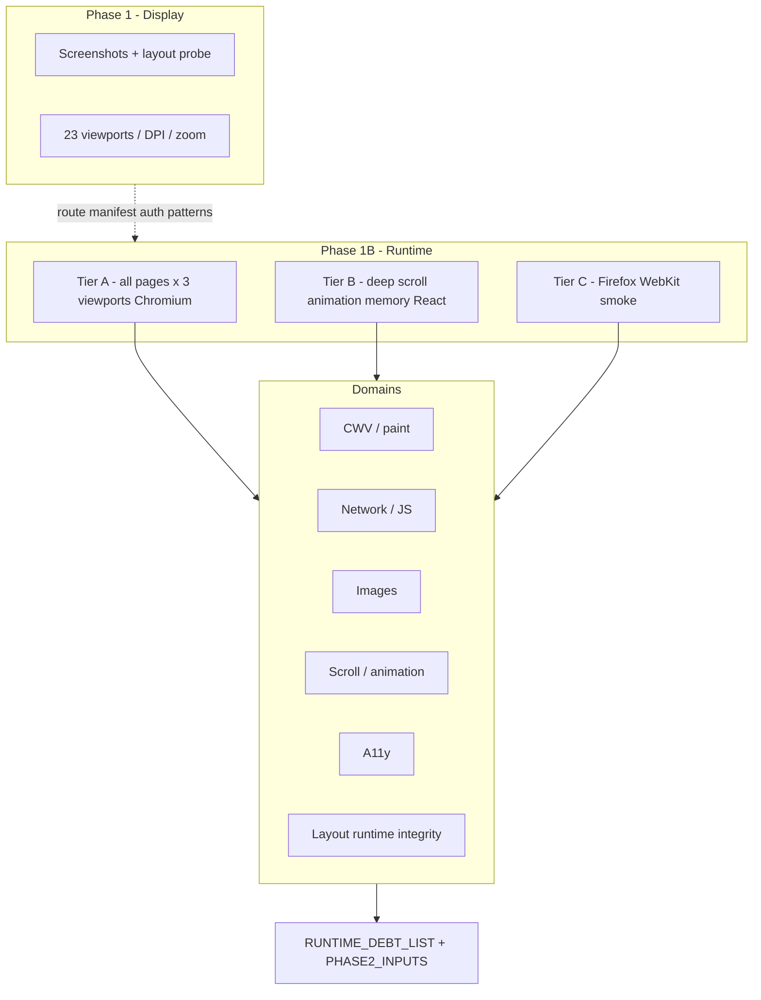

# Phase 1B Measurement Matrix

Phase 1 evidence stays display-authoritative. Phase 1B does not re-litigate viewport screenshot matrices unless a runtime layout defect requires a linking screenshot.
